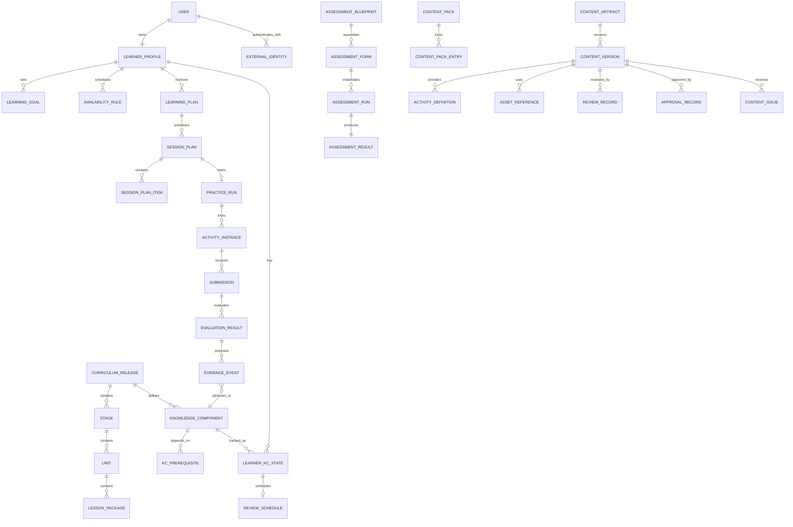

# Domain Model and Schemas Nekoru — MVP N5

**Status:** Approved v1.0 untuk baseline model domain  
**Tanggal:** 13 September 2026  
**Pemilik:** Engineering  
**Required reviewers:** Product, Academic/Content, Assessment, Data, Security/Privacy, Accessibility, dan QA  
**Cakupan domain:** U01–U24 dan jalur menuju `N5 Ready`  
**Cakupan implementasi pertama:** Entitas dan kontrak yang diperlukan Milestone 1 U01 online-only

## 1. Tujuan

Dokumen ini mendefinisikan model domain kanonik Nekoru, batas kepemilikan data, relasi antarkonsep, lifecycle, invariant, versioning, concurrency, idempotency, dan klasifikasi data. Dokumen menjadi sumber bagi:

1. schema PostgreSQL dan migration;
2. Zod/JSON Schema pada package kontrak bersama;
3. OpenAPI dan event schemas;
4. policy serta content manifests;
5. fixtures unit, contract, integration, dan end-to-end;
6. audit, export, deletion, recalculation, dan historical replay.

Dokumen ini menetapkan semantic model. Nama tabel atau detail index dapat disesuaikan melalui migration/ADR selama ownership, invariant, public contract, dan kemampuan reproduksi tidak berubah.

## 2. Dokumen Sumber

- [Implementation Readiness](./implementation-readiness.md)
- [Technical Architecture](./technical-architecture.md)
- [Curriculum Architecture](./curriculum-architecture.md)
- [Content Validation Rubric](./content-validation-rubric.md)
- [Learning Engine](./learning-engine.md)
- [Mastery Specification](./mastery-specification.md)
- [Practice Engine](./practice-engine.md)
- [Assessment Specification N5](./assessment-specification-n5.md)
- [Content Progression N5](../content/content-progression-n5.md)
- seluruh inventory dan blueprint pada `docs/content/`.

Jika terdapat konflik, dokumen domain akademik menentukan makna akademik, Technical Architecture menentukan boundary sistem, dan Definition of Done menentukan release gate.

## 3. Prinsip Model

1. **PostgreSQL adalah sumber kebenaran bisnis.** Cache, client storage, AI response, dan analytics tidak berwenang mengubah status akademik.
2. **Historis tidak ditulis ulang.** Submission, evaluation, evidence, assessment result, publication, dan audit dikoreksi melalui record baru yang mereferensikan record lama.
3. **Semua keputusan penting version-locked.** Run mengunci curriculum, content, policy, evaluator, assessment, dan manifest version yang digunakan.
4. **Completion bukan mastery.** Penyelesaian session dan perubahan `LearnerKCState` merupakan proses berbeda.
5. **Konten dan runtime terpisah.** Runtime hanya menggunakan version konten `approved/published` yang terdapat dalam release manifest kompatibel.
6. **AI bukan authority.** AI hanya menghasilkan candidate result sesuai rubric; acceptance evidence tetap deterministik dan dapat diaudit.
7. **Fail closed.** Version, policy, mapping, authority, atau rights yang hilang memblokir operasi terkait.
8. **Idempotent by default.** Retry tidak menciptakan efek akademik atau operasional kedua.
9. **Authorization dimiliki backend.** Identity provider membuktikan identity, bukan role atau permission.
10. **Data minimization.** Raw answer dan data aksesibilitas sensitif tidak masuk log atau analytics generik.

## 4. Bounded Modules dan Ownership

| Module | Data yang dimiliki | Tidak boleh dimiliki/diputuskan |
| --- | --- | --- |
| Identity & Access | User, external identity, session reference, staff allowlist, role assignment, permission | Mastery, content approval, assessment score |
| Learner Profile | Profile, goal, availability, locale, preference, approved accommodation reference | Curriculum rule atau authority internal |
| Curriculum & Content | Curriculum release, Stage, Unit, Lesson, KC, prerequisites, artifact/version, asset, content pack | Learner mastery atau runtime selection |
| Learning & Mastery | Learning plan, session plan, evidence, KC state, review, misconception, gate, readiness, decision | Rendering interaction atau answer key authoring |
| Practice | Practice run, activity instance, attempt, submission, evaluation, feedback release, practice event | Eligibility, prerequisite, mastery, readiness |
| Assessment | Blueprint, form, run, response lock, score/result, technical review, retake eligibility | Learner mastery mutation langsung |
| Content Operations | Review, criterion result, finding, approval, waiver, issue, quarantine, adjudication | Authentication provider state atau learner response mutation |
| Platform & Audit | Idempotency receipt, outbox, inbox, immutable audit event, job receipt | Domain decision tanpa originating command |

Cross-module write dilakukan melalui application command dalam transaksi yang didefinisikan atau melalui versioned event. Module tidak membaca tabel private module lain sebagai shortcut keputusan.

## 5. Peta Domain



Diagram menunjukkan relasi konseptual. Relasi polymorphic seperti version reference, audit target, dan asset owner harus menggunakan typed reference yang tervalidasi; bukan foreign key string tanpa registry.

## 6. Tipe Kanonik

### 6.1 Identifier

Semua identifier:

- menggunakan ULID sortable;
- disimpan sebagai string ASCII dengan prefix jenis;
- immutable dan tidak membawa makna akademik selain jenis;
- dibuat server-side kecuali client-generated event ID yang secara eksplisit diizinkan untuk offline;
- divalidasi pada setiap boundary.

| Jenis | Prefix |
| --- | --- |
| User | `usr_` |
| Learner profile | `lrn_` |
| Curriculum release | `cur_` |
| Knowledge component | `kc_` |
| Content artifact/version | `cnt_` / `cnv_` |
| Content pack | `cpk_` |
| Learning/session plan | `lpl_` / `spl_` |
| Practice run/activity instance | `prn_` / `ain_` |
| Submission/evaluation | `sub_` / `evl_` |
| Evidence event | `evd_` |
| Mastery state/decision | `mty_` / `dec_` |
| Assessment blueprint/form/run | `abp_` / `afm_` / `arn_` |
| Review/approval/issue | `rev_` / `app_` / `iss_` |
| Asset | `ast_` |
| Audit event | `aud_` |

### 6.2 Waktu

- Timestamp disimpan sebagai UTC dengan precision yang konsisten.
- API menggunakan RFC 3339 dengan suffix `Z`.
- Date lokal learner menggunakan ISO `YYYY-MM-DD` disertai IANA timezone.
- Deadline/timer assessment menyimpan server timestamp dan duration; tidak bergantung pada jam client.
- Record immutable memiliki `occurred_at`; mutable aggregate memiliki `created_at` dan `updated_at`.

### 6.3 Version dan hash

```yaml
version_ref:
  id: string
  version: integer
  hash: sha256_hex
```

Setiap run dan decision menggunakan `VersionSet`:

```yaml
version_set:
  curriculum: { id, version, hash }
  content_pack: { id, version, hash }
  learning_policy: { id, version, hash }
  mastery_policy: { id, version, hash }
  practice_policy: { id, version, hash }
  evaluator: { id, version, hash }
  assessment_blueprint: null_or_version_ref
```

Hash dihitung dari canonical JSON. Algoritme canonicalization dan daftar field yang di-hash wajib ditetapkan dalam ADR dan fixtures lintas-runtime.

### 6.4 Revision

Aggregate mutable memiliki integer `revision` mulai dari `1`. Mutation wajib membawa `expected_revision`. Ketidaksesuaian menghasilkan `STALE_REVISION`; last-write-wins dilarang untuk state penting.

## 7. Identity dan Learner Profile

### 7.1 User

| Field | Tipe | Aturan |
| --- | --- | --- |
| `id` | UserId | Wajib, immutable |
| `status` | enum | `active`, `suspended`, `deletion_pending`, `anonymized` |
| `primary_email_normalized` | string/null | PII; bukan public identifier |
| `locale` | BCP-47 | Default MVP `id-ID` |
| `timezone` | IANA timezone | Wajib sebelum plan dibuat |
| `created_at` | timestamp | Immutable |
| `revision` | integer | Optimistic concurrency |

### 7.2 ExternalIdentity

| Field | Tipe | Aturan |
| --- | --- | --- |
| `id` | ULID | Internal identifier |
| `user_id` | UserId | Wajib |
| `provider` | enum | Milestone 1: `clerk` |
| `provider_subject` | string | Unik per provider; terenkripsi/terproteksi sesuai klasifikasi |
| `sign_in_method` | enum | `google`, `email_link` |
| `verified_at` | timestamp/null | Diambil dari verified provider claim |
| `last_synced_at` | timestamp | Untuk reconciliation |

Token, magic link, dan credential tidak disimpan pada entitas ini.

### 7.3 LearnerProfile

| Field | Tipe | Aturan |
| --- | --- | --- |
| `id` | LearnerId | Wajib |
| `user_id` | UserId | Unik |
| `display_name` | string/null | Panjang dan sanitization dibatasi |
| `experience_path` | enum | `absolute_beginner`, `placement` |
| `locale` | BCP-47 | `id-ID` pada MVP |
| `timezone` | IANA timezone | Wajib |
| `preference_refs` | array | Hanya preference yang tidak mengubah konstruk |
| `accommodation_profile_ref` | nullable ref | Hanya approved profile |
| `revision` | integer | Wajib |

### 7.4 LearningGoal dan AvailabilityRule

`LearningGoal` menyimpan target level, tanggal target opsional, intensity preference, status, dan revision. `AvailabilityRule` menyimpan day-of-week, local start window, session minutes, timezone, effective period, dan revision.

Goal dan availability tidak menyimpan hasil perhitungan jadwal sebagai authority. Projection selalu merupakan output versioned Learning Engine.

### 7.5 GuestOnboardingDraft

Guest draft berada di client storage dan belum menjadi record server authoritative. Schema minimum:

```yaml
schema_version: integer
draft_id: uuid
created_at: timestamp
expires_at: timestamp
goal: object
availability: array
locale: id-ID
timezone: iana_timezone
migration_state: local | migrating | migrated | failed
```

Draft berlaku maksimum tujuh hari. Migrasi menggunakan `draft_id` sebagai idempotency scope. Setelah receipt sukses diterima, salinan lokal dibersihkan secara idempotent.

## 8. Curriculum dan Content

### 8.1 Curriculum hierarchy

`CurriculumRelease → Stage → Unit → LessonPackage`. Semua node memiliki stable ID, version, order, title, outcome, prerequisite reference, target assignment, status, dan validity period.

Milestone 1 wajib memakai model generik yang dapat memuat seluruh enam stage dan 24 unit. Query boleh hanya mengembalikan U01 dari seed aktif.

### 8.2 KnowledgeComponent

| Field | Tipe | Aturan |
| --- | --- | --- |
| `id` | KnowledgeComponentId | Stable lintas version jika makna tidak berubah |
| `version` | integer | Naik saat semantic contract berubah |
| `domain` | enum | `sound`, `kana`, `vocabulary`, `kanji`, `grammar`, `reading`, `listening` |
| `subtype` | registry key | Wajib terdaftar |
| `title_internal` | string | Bukan learner-facing label langsung |
| `first_unit_id` | UnitId | Wajib |
| `requiredness` | enum | `required`, `supporting`, `enrichment`, `TBD` |
| `diagnostic_dimensions` | array | Registry references |
| `evidence_blueprint_ref` | VersionRef | Wajib sebelum `approved` |
| `status` | enum | `draft`, `review`, `approved`, `deprecated` |

`requiredness: TBD` tidak boleh ikut gate atau readiness.

### 8.3 KCPrerequisite

Relasi memiliki `source_kc_id`, `target_kc_id`, `relation_type`, threshold/policy ref, rationale, dan version. `relation_type` adalah `hard`, `soft`, atau `co_requisite`. Graph harus bebas cycle untuk edge `hard` dan tidak memiliki dangling reference.

### 8.4 ContentArtifact dan ContentVersion

`ContentArtifact` adalah identitas logical item. Body, answer, rationale, mapping, rights, dan asset terdapat pada immutable `ContentVersion`.

Lifecycle:

```text
draft → academic_review → revision_required → approved → published
                                      └──────→ rejected
published → deprecated
approved/published → quarantined → revision_required | deprecated | approved
```

Published version tidak diedit. Koreksi membuat version baru, kemudian publication pointer dapat dipindahkan setelah compatibility dan impact review.

### 8.5 ContentPack

Content pack adalah manifest immutable berisi exact `ContentVersion` dan `AssetVersion` beserta checksum. Status: `building`, `validation_failed`, `approved`, `published`, `deprecated`, atau `quarantined`.

Runtime hanya menerima pack `approved/published`, compatible dengan curriculum/policy aktif, tidak expired, dan lolos signature/hash verification.

### 8.6 AssetReference

Asset menyimpan MIME, byte size, checksum, storage key immutable, rights reference, accessibility alternative, locale/language, status QA, serta platform compatibility. URL sementara bukan bagian identitas asset.

## 9. Learning Plan, Session, Evidence, dan Mastery

### 9.1 LearningPlan

Learning plan adalah aggregate mutable dengan version history. Ia menyimpan learner, goal version, active curriculum release, starting point, projection, risk classification, confidence, status, reason codes, dan revision.

Status: `draft`, `active`, `replan_required`, `superseded`, atau `completed`.

### 9.2 SessionPlan

Session plan adalah keputusan immutable setelah dikunci. Field minimum:

- ID dan learner ID;
- source learning-plan revision;
- `VersionSet`;
- mode dan target duration;
- ordered plan items;
- target KC serta alasan pemilihan;
- review/new-content allocation;
- generated timestamp dan expiration;
- decision hash.

### 9.3 SessionPlanItem

Setiap item menunjuk target KC, content/activity definition version, purpose (`new`, `review`, `remedial`, `probe`, `exit_check`), priority, estimated duration, dan support policy. Runtime tidak mengganti version atau mapping setelah run dimulai.

### 9.4 EvidenceEvent

EvidenceEvent bersifat append-only:

| Field | Tipe | Aturan |
| --- | --- | --- |
| `id` | EvidenceId | Wajib |
| `learner_id` | LearnerId | Wajib |
| `kc_id` | KCId | Tepat satu primary KC |
| `evidence_type` | registry key | Wajib terdaftar |
| `source_ref` | typed ref | Submission atau assessment result |
| `encounter_id` | string | Untuk deduplication stimulus |
| `signal` | object | Accuracy/quality/hint/support/difficulty sesuai policy |
| `eligibility` | enum | `accepted`, `rejected`, `pending`, `superseded` |
| `reason_codes` | array | Wajib untuk selain accepted |
| `version_set` | VersionSet | Wajib |
| `occurred_at` | timestamp | Immutable |
| `supersedes_id` | nullable EvidenceId | Koreksi, bukan overwrite |

### 9.5 LearnerKCState

`LearnerKCState` adalah materialized authoritative state yang dapat dihitung ulang dari evidence dan policy. Ia menyimpan status, mastery score internal, confidence, evidence sufficiency, diagnostic dimensions, last evidence, review due, policy version, calculation hash, dan revision.

Status dasar: `not_started`, `learning`, `provisional`, `mastered`, dan `review_required`. UI dapat memakai label terlokalisasi tetapi tidak membuat status tambahan.

### 9.6 ReviewSchedule dan MisconceptionState

Review schedule menyimpan KC, due time, interval step, urgency, source state, policy version, serta status. Misconception state menyimpan approved taxonomy key, supporting evidence refs, confidence, activation state, remedial plan ref, dan expiry/review rule.

## 10. Practice

### 10.1 PracticeRun

PracticeRun mengikat SessionPlan dengan execution state. Status:

```text
created → active → paused → completed
                 └→ abandoned
created/active/paused → invalidated
```

Field minimum mencakup run ID, learner, session plan, `VersionSet`, mode, state, current item, timestamps, resume token version, revision, serta completion summary reference.

### 10.2 ActivityDefinition

Definition berasal dari approved ContentVersion dan memuat:

- activity type dan allowed interaction types;
- stimulus/prompt/option/token references;
- evaluator dan answer policy;
- primary/supporting KC mapping;
- attempt, hint, skip, reveal, feedback, replay, timer, dan support policy;
- accessibility alternative dan construct-equivalence state;
- asset references;
- version dan hash.

### 10.3 ActivityInstance

Instance mengunci definition version, resolved content, option/token order, random seed, support variant, assets, answer policy, evaluator version, dan release policy. Instance immutable setelah dibuat.

### 10.4 Submission

Submission menyimpan raw response secara terproteksi, normalized response, response schema version, attempt number, hint/support state, replay usage, client event time, received time, idempotency key, dan instance reference.

Draft interaction bukan submission. Attempt hanya bertambah setelah submission valid diterima.

### 10.5 EvaluationResult

EvaluationResult bersifat immutable dan dapat memiliki status `correct`, `partial`, `incorrect`, `pending`, `invalid`, atau `technical_failure`. Ia menyimpan score/parts, reason codes, evaluator version, rubric reference bila ada, feedback release reference, calculation hash, dan `supersedes_id` bila dikoreksi.

`pending`, `invalid`, dan `technical_failure` tidak menghasilkan penalty atau false incorrect.

### 10.6 FeedbackRelease

Record ini menentukan kapan correctness, answer, rationale, misconception, dan next action boleh ditampilkan. Client tidak menerima field yang masih ditahan.

## 11. Assessment

Assessment menggunakan aggregate tersendiri karena form locking, timer, feedback hold, invalidation, dan retake memiliki aturan berbeda dari practice biasa.

Entitas minimum:

- `AssessmentBlueprint`;
- `AssessmentForm` dan `AssessmentFormItem`;
- `AssessmentRun`;
- `AssessmentResponseLock`;
- `AssessmentResult`;
- `AssessmentTechnicalReview`;
- `AssessmentAdjudication`;
- `RetakeEligibility`.

Milestone 1 belum mengimplementasikan entitas tersebut selain typed nullable reference dalam `VersionSet`. Schema lengkap wajib sebelum Milestone 4.

## 12. Content Operations

Entitas minimum untuk Milestone 3:

- `ReviewRecord`;
- `CriterionResult`;
- `Finding`;
- `ApprovalRecord`;
- `WaiverRecord`;
- `ContentIssue`;
- `QuarantineDecision`;
- `AdjudicationRecord`;
- `PublicationRecord`;
- `MigrationRecord`;
- `RollbackRecord`.

Setiap keputusan mencatat actor, active role, authority, target/version, input, output, reason, timestamp, dan correlation ID. Author tidak dapat menjadi sole approver artefaknya sendiri.

Pada Milestone 1, hasil approval seed direpresentasikan dalam signed/versioned build manifest. Schema harus kompatibel dengan migrasi menuju workflow database tanpa mengubah identity ContentVersion.

## 13. Platform dan Audit

### 13.1 IdempotencyRecord

Menyimpan scope, key, actor, route/command, request fingerprint, processing status, response reference, created time, dan expiry policy key. Key yang sama dengan fingerprint berbeda ditolak.

### 13.2 OutboxEvent dan InboxReceipt

Outbox ditulis dalam transaksi yang sama dengan perubahan domain. Inbox menyimpan producer, message/event ID, payload hash, handler version, delivery status, attempts, dan effect receipt. Duplicate delivery mengembalikan receipt sebelumnya.

### 13.3 AuditEvent

AuditEvent append-only berisi actor/subject, active role, authority decision, command, target typed reference, input/output hashes, reason codes, version refs, correlation ID, outcome, dan timestamp. Audit tidak menyimpan secret atau raw answer.

### 13.4 DecisionRecord

Setiap keputusan Learning/Mastery yang memengaruhi learner mempunyai input refs, policy/version, ordered reason codes, output, calculation/decision hash, dan optional superseding decision. Record harus cukup untuk historical replay.

## 14. Invariant Lintas-Domain

1. Hanya satu active LearningPlan per learner dan target context.
2. SessionPlan tidak dapat dibuat tanpa curriculum, content, dan policy version yang kompatibel.
3. ActivityInstance tidak berubah setelah run dimulai.
4. Satu valid submission sequence menghasilkan paling banyak satu active EvaluationResult.
5. Satu source/evidence mapping menghasilkan paling banyak satu active EvidenceEvent per primary KC dan policy attribution.
6. Setiap scored item memiliki tepat satu primary KC.
7. Supporting evidence hanya berlaku jika mapping dan diagnostic confidence sudah disetujui.
8. Completion tidak menulis mastery secara langsung.
9. Mastery state selalu menunjuk evidence set dan policy version yang dapat direproduksi.
10. Konten draft, rejected, deprecated, atau quarantined tidak dipilih untuk run baru.
11. Published ContentVersion tidak dapat diedit.
12. Assessment feedback yang ditahan tidak dikirim ke client.
13. Technical failure tidak berubah menjadi incorrect.
14. Authorization check menggunakan role, permission, assignment, active role, dan target scope dari backend.
15. Tidak ada cascade delete yang menghapus evidence, score, publication, atau audit historis.

## 15. Data Classification

| Kelas | Contoh | Aturan baseline |
| --- | --- | --- |
| Public | Label produk dan asset public yang disetujui | Dapat di-cache sesuai version |
| Internal | Curriculum metadata, content draft, policy, operational dashboard | Authenticated dan least privilege |
| Confidential | Email, raw response, learner history, staff note | Encryption/provider controls, access audit, tidak masuk generic telemetry |
| Restricted | Token, magic link, secret, hidden answer, unreleased assessment form | Tidak dicatat di log; akses sangat terbatas; answer tidak dikirim sebelum release |

Retention duration masih `TBD` sampai Privacy/Legal, Security, dan Product menyetujui retention schedule. Setiap tabel menyimpan `retention_policy_key`; tidak ada angka TTL tersembunyi.

## 16. Deletion, Export, dan Legal Hold

Model harus mendukung:

1. export data learner yang terotorisasi;
2. deletion/anonymization workflow berbasis state, bukan hard-delete langsung;
3. legal hold yang memblokir purge dan mencatat audit;
4. purge receipt per PostgreSQL, object storage, cache, analytics, dan provider;
5. pemisahan data yang dapat dianonimkan dari bukti audit minimum sesuai policy;
6. preview dampak dan approval untuk operasi sensitif.

Detail duration dan lawful basis berada pada dokumen Security, Privacy & Data Governance dan tetap menjadi blocker production.

## 17. Schema Artifact Map

Dokumen ini harus diturunkan menjadi file executable berikut saat repository aplikasi dibuat:

```text
packages/
  contracts/
    src/common/ids.ts
    src/common/version-ref.ts
    src/common/problem.ts
    src/identity/*.schema.ts
    src/profile/*.schema.ts
    src/learning/*.schema.ts
    src/practice/*.schema.ts
    src/content/*.schema.ts
    src/assessment/*.schema.ts
    src/events/*.schema.ts
  policies/
    schemas/*.schema.ts
  content-schema/
    schemas/*.schema.ts
apps/api/
  src/db/schema/*.ts
  drizzle/*.sql
```

Nama final mengikuti struktur repository yang disetujui, tetapi pemisahan contract, policy, content schema, dan persistence adapter wajib dipertahankan.

## 18. Migration dan Compatibility

1. Semua perubahan database dilakukan melalui migration berurutan dan immutable.
2. Migration diuji dari database kosong dan snapshot version sebelumnya.
3. Additive contract change mempertahankan pembaca versi lama selama compatibility window.
4. Breaking public contract menggunakan versi API/event/schema baru.
5. Historical VersionSet tetap dapat di-resolve atau ditandai eksplisit sebagai unavailable tanpa mengganti versi terdekat.
6. Content rollback memindahkan active manifest pointer; tidak menghapus version lama.
7. Mastery recalculation menghasilkan decision/state revision baru dan mempertahankan hasil sebelumnya untuk audit.
8. Destructive schema migration memerlukan backup/restore evidence dan ADR.

## 19. Milestone 1 Required Schema Set

Schema berikut wajib lengkap sebelum feature implementation U01:

- User dan ExternalIdentity;
- LearnerProfile, LearningGoal, AvailabilityRule, dan GuestOnboardingDraft;
- CurriculumRelease, Stage, Unit, LessonPackage, KnowledgeComponent, dan KCPrerequisite;
- ContentArtifact, ContentVersion, ContentPack, ContentPackEntry, dan AssetReference;
- LearningPlan, SessionPlan, dan SessionPlanItem;
- PracticeRun, ActivityDefinition, ActivityInstance, Submission, EvaluationResult, serta FeedbackRelease;
- EvidenceEvent, LearnerKCState, ReviewSchedule, dan DecisionRecord;
- IdempotencyRecord, OutboxEvent, InboxReceipt, dan AuditEvent;
- common ID, timestamp, version, revision, hash, reason-code, typed-reference, dan problem-detail schemas.

Assessment dan database-backed Content Operations schemas boleh berupa reserved namespace pada Milestone 1, tetapi tidak boleh dipalsukan sebagai implementasi aktif.

## 20. Test Fixtures Minimum

1. valid U01 curriculum/content/policy VersionSet;
2. missing/incompatible version;
3. content draft atau quarantined dipilih runtime;
4. hard-prerequisite cycle dan dangling reference;
5. duplicate guest-draft migration;
6. duplicate session start dan submission;
7. idempotency key dengan fingerprint berbeda;
8. stale aggregate revision;
9. audio technical failure;
10. pending/invalid evaluation tanpa mastery penalty;
11. accepted dan rejected evidence;
12. mastery recalculation deterministik;
13. correction melalui `supersedes_id`;
14. hidden answer tidak terdapat pada pre-release client contract;
15. raw answer tidak masuk audit atau telemetry fixture;
16. unauthorized role/assignment;
17. migration dari database kosong serta previous fixture version.

## 21. Keputusan Terbuka

| ID | Keputusan | Rekomendasi | Dampak | Status |
| --- | --- | --- | --- | --- |
| `DOMAIN-OPEN-001` | Canonical JSON implementation untuk hashing | Pilih RFC 8785/JCS-compatible implementation dan kunci golden fixtures | Semua decision hash | Menunggu ADR-003 |
| `DOMAIN-OPEN-002` | Enkripsi field-level untuk email/raw response selain encryption at rest | Terapkan untuk raw response dan data yang memerlukan operator separation; verifikasi dampak query/export | Security dan operations | Menunggu threat model |
| `DOMAIN-OPEN-003` | Physical partitioning EvidenceEvent/AuditEvent | Tunda sampai volume projection dan retention policy tersedia | Database operations | Tidak memblokir Milestone 1 |
| `DOMAIN-OPEN-004` | Exact retention per data class | Jangan menetapkan default; gunakan `retention_policy_key` | Production release | Blocked oleh `BLK-PRIV-001` |
| `DOMAIN-OPEN-005` | Offline client-generated ID format | Gunakan UUID/ULID namespaced setelah protocol offline disetujui | Milestone 5 | Tidak memblokir Milestone 1 |

## 22. Definition of Ready untuk Dokumen Berikutnya

`learning-policy-and-registry-n5.md` dapat disusun setelah:

1. domain dan status KC disetujui;
2. bentuk EvidenceEvent dan LearnerKCState disetujui;
3. `VersionSet`, version reference, dan decision hash contract disetujui;
4. requiredness `TBD` dipastikan fail-closed;
5. batas keputusan Learning, Practice, Assessment, dan Content disetujui.

## 23. Acceptance Criteria

Dokumen ini dapat berstatus `approved` jika:

1. seluruh module memiliki ownership dan larangan boundary yang eksplisit;
2. model mendukung U01–U24 tanpa logic khusus U01;
3. Milestone 1 required schema set lengkap secara konseptual;
4. content identity dipisahkan dari immutable version;
5. run dan decision mengunci VersionSet yang tepat;
6. submission, evaluation, evidence, publication, dan audit dapat dikoreksi tanpa overwrite historis;
7. idempotency dan optimistic concurrency menjadi bagian kontrak;
8. completion, evidence, mastery, gate, assessment, dan readiness tetap terpisah;
9. authorization tidak diturunkan dari identity provider atau visibility UI;
10. data classification, retention key, export, deletion, dan legal-hold capability tercakup;
11. seluruh invariant memiliki minimal satu test fixture;
12. open decision memiliki owner serta fail-closed behavior;
13. Product, Engineering, Academic, Data, Security/Privacy, Accessibility, dan QA menyetujui version ini.

## 24. Decision Record

| ID | Keputusan | Status | Owner | Tanggal |
| --- | --- | --- | --- | --- |
| `DOMAIN-001` | PostgreSQL menjadi sumber kebenaran bisnis. | `approved` | Engineering | 13 September 2026 |
| `DOMAIN-002` | Model domain berlaku untuk U01–U24; Milestone 1 hanya mengaktifkan subset U01. | `approved` | Product + Engineering | 13 September 2026 |
| `DOMAIN-003` | ContentArtifact memiliki ContentVersion immutable dan dipublikasikan melalui exact-version ContentPack. | `approved` | Engineering + Content | 13 September 2026 |
| `DOMAIN-004` | Session dan runtime decision mengunci VersionSet dan decision hash. | `approved` | Engineering + Academic | 13 September 2026 |
| `DOMAIN-005` | Submission, EvaluationResult, EvidenceEvent, dan AuditEvent bersifat append-only/superseding. | `approved` | Engineering + Data | 13 September 2026 |
| `DOMAIN-006` | Aggregate mutable memakai integer revision dan optimistic concurrency. | `approved` | Engineering | 13 September 2026 |
| `DOMAIN-007` | Mutation akademik dan operasional memakai idempotency record; asynchronous delivery memakai outbox/inbox. | `approved` | Engineering | 13 September 2026 |
| `DOMAIN-008` | Retention duration tetap `TBD`; schema memakai policy key dan production fail-closed. | `approved` | Security/Privacy + Product | 13 September 2026 |
