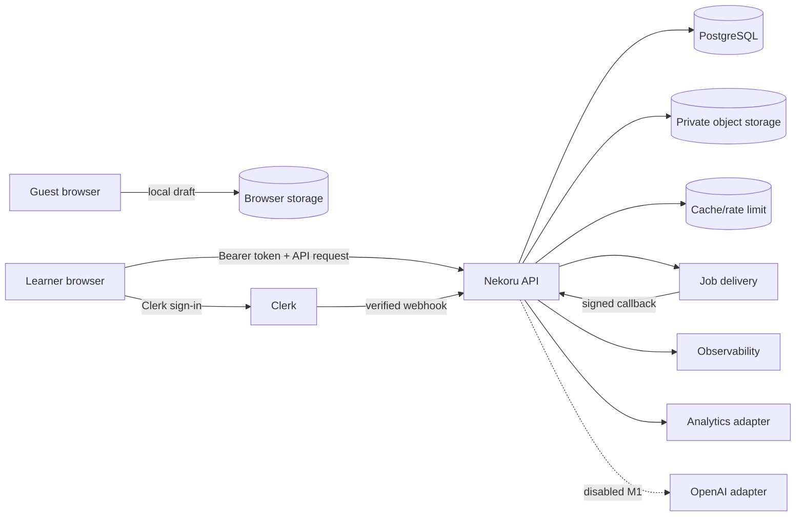

# Security, Privacy, and Data Governance Nekoru — MVP N5

**Status:** Approved v1.0 — technical baseline; legal/production approval pending  
**Tanggal:** 13 September 2026  
**Pemilik:** Security/Privacy dan Engineering  
**Required reviewers:** Product, Legal/Privacy Counsel, Data, Operations, Academic/Content, Accessibility, QA, dan Vendor Management  
**Cakupan aktif:** Milestone 1 U01 online-only  
**Release blocker:** Retention schedule, legal basis/notice, vendor data handling, dan production incident ownership

## 1. Tujuan

Dokumen ini menetapkan batas keamanan, privasi, dan tata kelola data Nekoru. Tujuannya adalah memastikan bahwa identity, learner data, jawaban, evidence, mastery, content, assessment, audit, analytics, dan provider integration:

1. dikumpulkan untuk tujuan yang jelas dan minimum;
2. hanya dapat diakses oleh actor yang berwenang;
3. tidak bocor melalui UI, API, log, analytics, cache, asset, atau AI;
4. dapat diekspor, dikoreksi, dianonimkan, ditahan, dan dihapus sesuai policy yang disetujui;
5. mempertahankan historical audit tanpa menyimpan data personal tanpa batas;
6. gagal secara aman ketika identity, policy, provider, atau integrity tidak dapat diverifikasi;
7. memiliki threat model, control, evidence, owner, dan incident response yang dapat diaudit.

Dokumen ini bukan nasihat hukum dan tidak menetapkan sendiri kewajiban yurisdiksi. Legal/Privacy Counsel harus menyetujui legal basis, notice, consent, hak subjek data, transfer/region, kontrak vendor, usia minimum, dan retention sebelum production.

## 2. Dokumen Sumber

- [Implementation Readiness](./implementation-readiness.md)
- [Domain Model and Schemas](./domain-model-and-schemas.md)
- [Learning Policy and Registry N5](./learning-policy-and-registry-n5.md)
- [API and Event Contracts](./api-and-event-contracts.md)
- [Technical Architecture](./technical-architecture.md)
- [Definition of Done](./definition-of-done.md)
- [Content Validation Rubric](./content-validation-rubric.md)
- [Assessment Specification N5](./assessment-specification-n5.md)
- [Analytics and Implementation Handoff](../ui-ux/10-analytics-and-handoff.md)
- [Accessibility, Content, and Edge Cases](../ui-ux/08-accessibility-content-and-edge-cases.md)

## 3. Security and Privacy Principles

1. **Least privilege:** akses minimum berdasarkan role, permission, assignment, active role, resource, lifecycle, dan environment.
2. **Default deny:** kegagalan memuat policy/authority tidak memberi akses.
3. **Defense in depth:** client guard, API authorization, database constraint, provider configuration, audit, dan monitoring saling melengkapi.
4. **Data minimization:** kumpulkan dan simpan hanya data yang diperlukan untuk tujuan yang terdokumentasi.
5. **Purpose separation:** domain, audit, operations, analytics, research, dan AI data tidak dicampur tanpa approval.
6. **Immutable accountability:** keputusan sensitif menghasilkan audit record append-only.
7. **No silent retention:** setiap data class memakai retention-policy key; production tidak memakai TTL asumtif.
8. **No answer leakage:** hidden answer/rubric/content tidak dikirim sebelum release policy.
9. **Safe failure:** gangguan teknis tidak menjadi kesalahan akademik atau bypass security.
10. **User dignity:** accessibility preference dan learning weakness tidak diperlakukan sebagai diagnosis atau profiling sensitif generik.
11. **Provider replaceability:** internal IDs dan contract tidak bergantung langsung pada provider identity/analytics/AI.
12. **Verifiable controls:** setiap requirement memiliki test, log/receipt, owner, dan review cadence.

## 4. Scope

### 4.1 Data dalam scope

- account dan external identity reference;
- learner profile, goal, availability, timezone, dan preference;
- learning plan dan session plan;
- practice response, evaluation, evidence, mastery, review, misconception, serta progress;
- assessment form/run/result pada milestone lanjutan;
- content, answer, rubric, asset, rights, review, publication, issue, dan quarantine;
- audit trail;
- application/operational telemetry;
- optional product/learning analytics;
- usability-research data;
- provider request/response dan export/deletion receipt.

### 4.2 Sistem/provider dalam scope

- learner web dan Content Operations web;
- API modular monolith;
- PostgreSQL;
- object storage/CDN;
- cache/rate-limit store;
- job delivery;
- Clerk;
- error/observability provider;
- analytics provider jika dipilih;
- OpenAI setelah diaktifkan pada milestone berikutnya;
- email delivery yang digunakan identity provider.

## 5. Actor dan Trust Boundary

| Actor | Trust baseline | Batas |
| --- | --- | --- |
| Guest | Unauthenticated/untrusted | Hanya local onboarding draft dan public entry content |
| Learner | Authenticated, untrusted client | Hanya resource miliknya dan released content |
| Content Author | Authenticated internal | Authoring sesuai assignment; bukan sole approver |
| Reviewer | Authenticated internal | Review pada scope/authority yang diberikan |
| Approver/Publisher | High-impact internal | Explicit action, separation of duties, audit |
| Support/Operations | Privileged terbatas | Case/operational access berdasarkan need-to-know |
| System worker | Service identity | Command/event allowlist, no ambient authority |
| Provider | External processor/service | Hanya data sesuai documented integration |
| Attacker | Untrusted | Tidak diasumsikan mengikuti UI/flow |

## 6. Data Flow



Rules:

- browser tidak mengakses PostgreSQL atau private object bucket secara langsung;
- presigned asset access dibatasi object, method, expiry, dan authorization context;
- provider payload divalidasi pada adapter boundary;
- generic observability/analytics tidak menerima raw answer atau secret;
- AI path tidak aktif pada Milestone 1.

## 7. Data Classification

| Class | Definisi | Contoh | Minimum control |
| --- | --- | --- | --- |
| `public` | Aman untuk publik setelah approval | Brand asset, public copy | Integrity/version control |
| `internal` | Untuk operasi internal | Policy, nonsecret config, draft taxonomy | Auth, least privilege |
| `confidential` | Data personal/learning/internal sensitif | Email, profile, evidence, mastery, staff assignment | Encryption, access audit, redacted logs |
| `restricted` | Kebocoran memberi dampak tinggi | Token, secret, hidden answer, unreleased form, raw response tertentu | Strong isolation, no generic logging, narrow access |

Setiap schema/table/event/property/asset menyatakan classification dan owner. Classification default untuk field baru adalah `confidential` sampai direview.

## 8. Data Inventory dan Purpose

| Data class | Tujuan | Source of truth | Sharing baseline |
| --- | --- | --- | --- |
| Identity reference | Authentication dan account continuity | Identity module/Clerk mapping | Clerk + Nekoru API |
| Profile/goal/availability | Personal plan | PostgreSQL | Internal modules sesuai need |
| Raw response | Evaluation, dispute, limited audit | Protected Practice storage | Practice/adjudication only |
| Structured evaluation | Feedback dan evidence candidate | PostgreSQL | Learning/Mastery |
| Evidence/mastery | Adaptation dan progress | PostgreSQL | Learner views + restricted analytics |
| Content/answer/rubric | Learning/assessment | Content Bank | Released subset ke client; hidden fields server-only |
| Audit | Accountability dan investigation | Append-only audit store | Authorized Security/Ops/owners |
| Operational telemetry | Reliability/security | Observability platform | Operations/Security |
| Product analytics | Product improvement | Analytics store | Aggregated Product/Data |
| Research data | Formative usability | Restricted research repository | Named research team |
| AI trace | Evaluation/adjudication jika aktif | Restricted adapter/audit store | Explicitly approved roles/provider |

Legal basis, notice wording, retention, international transfer, dan processor/controller classification tetap ditentukan dalam legal review.

## 9. Authentication Security

### 9.1 Clerk boundary

- Clerk menyediakan authentication/session, bukan authorization Nekoru.
- API memvalidasi signature, issuer, audience/authorized party, expiry, not-before, session state, dan allowed environment.
- Provider user ID disimpan sebagai external reference; internal User ID digunakan lintas domain.
- Token, magic link, OAuth code, dan full callback URL tidak masuk log.
- Synchronous identity reconciliation dilakukan setelah token valid; webhook menangani perubahan lanjutan secara idempotent.

### 9.2 Learner methods

- Google Sign-In;
- email link;
- tanpa password lokal;
- email response tidak mengungkap apakah account terdaftar;
- email link mengikuti provider expiry, resend cooldown, dan same-browser protection;
- account-link conflict tidak membuat duplicate user otomatis.

### 9.3 Session controls

Session expiry, revoke, logout, reauthentication, dan device/session listing behavior mengikuti documented provider configuration. High-risk account action memerlukan recent authentication bila didukung dan disetujui.

Exact session lifetime dan provider plan/limits harus diverifikasi sebelum production.

## 10. Authorization dan Internal Access

### 10.1 Authorization inputs

- actor internal ID dan status;
- active role;
- permission;
- assignment/resource scope;
- artifact lifecycle/status;
- action risk class;
- separation-of-duties rule;
- environment;
- optional recent-auth/step-up state.

### 10.2 Baseline roles

- `learner`;
- `content_author`;
- `linguistic_reviewer`;
- `academic_reviewer`;
- `assessment_reviewer`;
- `accessibility_reviewer`;
- `rights_reviewer`;
- `publisher`;
- `support_agent`;
- `operations_admin`;
- `security_auditor`;
- `product_owner`.

Permission terpisah dari role label dan disimpan sebagai machine-readable policy.

### 10.3 High-risk actions

Publish, quarantine, adjudication, migration, rollback, export, deletion, legal hold, access change, dan secret rotation memerlukan:

- explicit target dan exact version;
- current authority check;
- reason;
- confirmation yang sesuai risiko;
- idempotency dan expected revision;
- immutable audit receipt;
- recovery/rollback plan jika berlaku.

Author tidak menjadi sole approver. Emergency override tidak tersedia sampai policy khusus disetujui.

## 11. Browser and API Security

Baseline controls:

- TLS untuk semua connection;
- exact CORS origin allowlist per environment;
- secure cookie/provider settings sesuai architecture;
- CSRF protection untuk cookie-authenticated state bila digunakan;
- CSP yang membatasi script, frame, connect, media, font, dan object source;
- clickjacking protection untuk learner/internal surfaces;
- strict input/schema validation;
- output encoding dan sanitized controlled rich text;
- SVG allowlist: script, event handler, external reference, dan `foreignObject` ditolak;
- upload MIME, magic-byte, size, checksum, malware/safety, rights, dan quarantine checks;
- rate limit per identity/device/IP risk bucket/route;
- generic error response tanpa stack/internal path;
- dependency timeout, retry, circuit/fail-closed behavior;
- no authenticated API response dalam generic service-worker cache.

Content Security Policy dan exact rate limit menjadi environment configuration dengan automated verification.

## 12. Answer and Assessment Integrity

1. Answer key, hidden rationale, unreleased feedback, rubric, distractor diagnostic tag, dan future assessment item tidak dikirim sebelum release.
2. Client bundle/source map/static asset diperiksa untuk hidden content leakage.
3. ActivityInstance hanya memuat released stimulus/options dan policy summary.
4. Evaluation dilakukan server-side; local evaluator hanya untuk signed offline package pada milestone berikutnya.
5. Option shuffle/order terkunci dalam instance manifest.
6. Submission membawa stable IDs; client tidak mengirim correctness/evidence weight sebagai authority.
7. Assessment run menggunakan locked form dan server-authoritative timer.
8. Screen capture/proctoring invasif tidak termasuk MVP.
9. Abuse detection tidak otomatis menghukum learner tanpa review dan policy.
10. Technical failure menghasilkan recovery/technical review, bukan incorrect.

## 13. Content and Asset Security

- object storage private by default;
- immutable content-addressed/versioned object key;
- presigned URL short-lived dan scope-limited;
- checksum divalidasi sebelum release dan penggunaan;
- published manifest signed/hashed serta exact-version;
- quarantined asset tidak digunakan untuk run baru;
- rights metadata wajib;
- correction/rollback mempertahankan historical reference;
- public derivative tidak mengandung internal metadata, hidden answer, source credential, atau personal data;
- audio speaker release/consent reference disimpan terproteksi;
- asset processing berjalan dengan resource/time limits dan isolated temporary storage.

## 14. Guest Draft dan Client Storage

Guest draft:

- hanya menyimpan goal, availability, locale, timezone, schema/version, created/expiry, dan migration marker;
- tidak menyimpan token, hidden answer, raw learner response, atau staff data;
- memiliki expiry maksimum tujuh hari;
- menampilkan status “belum tersimpan ke akun”;
- dimigrasikan secara idempotent setelah authentication;
- tidak menimpa existing profile secara diam-diam;
- dibersihkan setelah durable migration receipt;
- tidak disinkronkan lintas-browser/device sebelum authentication.

Milestone 1 tidak menyimpan practice run offline. Authenticated runtime state berasal dari server.

## 15. Raw Response Protection

Raw response adalah `restricted` atau `confidential` sesuai activity/assessment context.

Controls:

1. dipisahkan dari generic event/log/analytics;
2. akses hanya untuk evaluator, authorized adjudication, dan approved support case;
3. setiap read/export diaudit;
4. field-level/application-layer encryption dipertimbangkan berdasarkan threat model;
5. display internal melakukan escaping dan minimization;
6. search/index tidak menyimpan plaintext lebih luas daripada kebutuhan;
7. purge/export mengikuti retention policy key;
8. cache tidak menyimpan raw response secara generik;
9. debug tooling menggunakan synthetic/redacted payload;
10. AI tidak menerima raw response sampai data-flow/provider approval tersedia.

## 16. Logging and Observability

### 16.1 Allowed

- correlation ID;
- internal actor ID bila diperlukan dan access-controlled;
- route template/command/module;
- aggregate/run/event/decision ID;
- active role dan authorization outcome code;
- version refs;
- result/error code;
- latency, retry, size bucket, dan dependency category.

### 16.2 Prohibited

- token, cookie, magic link, OAuth code;
- email/name;
- request/response body generik;
- raw answer;
- hidden content/rubric;
- presigned URL penuh;
- provider webhook body;
- AI prompt/response;
- private note;
- detailed accessibility/accommodation data.

### 16.3 Controls

- structured logging dengan schema allowlist;
- automatic secret/PII redaction;
- sampling tidak menghapus security-critical event;
- access control dan access audit;
- environment separation;
- alert untuk leakage assertion;
- retention policy key dan purge verification.

## 17. Analytics Privacy

Product analytics mengikuti [Analytics and Implementation Handoff](../ui-ux/10-analytics-and-handoff.md) dan menggunakan adapter vendor-neutral.

Rules:

- functional telemetry dipisahkan dari optional analytics;
- pre-auth identity menggunakan rotating anonymous key;
- anonymous→user linking memerlukan approved purpose/policy;
- user key bukan email atau provider subject;
- property allowlist divalidasi client dan ingestion;
- raw answer/PII/hidden content dilarang;
- small-group segmentation dibatasi;
- opt-out/export/deletion diterapkan setelah policy final;
- instrumentation failure tidak memblokir learning transaction.

## 18. Accessibility and Sensitive Inference

1. Accessibility preference digunakan untuk presentation/accommodation yang diminta, bukan diagnosis.
2. Preference tidak masuk generic analytics payload.
3. Support/accommodation tidak boleh digunakan untuk eligibility, pricing, risk scoring, atau engagement targeting.
4. Response time screen-reader/keyboard user tidak menjadi mastery penalty.
5. Internal access terhadap accommodation profile dibatasi need-to-know.
6. Export/deletion mencakup preference dan accommodation record sesuai policy.
7. Aggregate accessibility research memerlukan consent dan minimum cohort rule.

## 19. AI Data Boundary

AI evaluation untuk learner data **dinonaktifkan pada Milestone 1**.

Sebelum aktivasi, dokumen/version terpisah wajib menetapkan:

- allowed use cases;
- exact fields yang dapat dikirim;
- minimization/pseudonymization;
- provider/model/region/retention/training controls;
- prompt, rubric, reference, dan structured-output contract;
- timeout/retry/fallback;
- logging dan trace minimization;
- human review/adjudication;
- export/deletion/provider purge;
- threat model dan abuse cases;
- user notice/consent bila diperlukan;
- evaluation quality, fairness, dan rollback.

Tanpa approval Privacy/Legal, Security, Academic, dan Product, objective deterministic journey tetap berjalan dan AI path tetap disabled.

## 20. Vendor Governance

Setiap provider memiliki registry entry:

```yaml
provider_id: clerk
service_purpose: authentication
data_classes: [confidential]
data_fields: [provider_subject, email, session_metadata]
regions: TBD
subprocessors: TBD
provider_retention: TBD
training_use: not_applicable_or_TBD
encryption: TBD
incident_notification: TBD
export_capability: TBD
deletion_capability: TBD
availability_dependency: critical
exit_strategy: TBD
owner: SecurityPrivacy
reviewed_at: null
approval_status: pending
```

Registry minimum mencakup Vercel, Neon, Cloudflare R2, Upstash Redis/QStash, Clerk, observability/error provider, analytics provider, email provider melalui identity service, dan OpenAI bila diaktifkan.

Production use memerlukan contract/terms review, data-flow confirmation, region, access, retention, incident, deletion, export, cost/quota, dan exit strategy.

## 21. Retention Schedule Contract

Retention duration belum ditetapkan. Schedule final harus mendefinisikan per data class:

| Field | Makna |
| --- | --- |
| `policy_key` | Stable reference dari schema/table |
| `data_class` | Jenis data |
| `purpose` | Tujuan penyimpanan |
| `legal_basis` | Hasil legal review |
| `retention_duration` | Nilai approved, bukan default engineering |
| `retention_anchor` | Event awal hitung duration |
| `archive_rule` | Bila ada |
| `deletion_action` | Delete, anonymize, aggregate, atau retain-minimum |
| `legal_hold_behavior` | Scope dan approval |
| `provider_mapping` | Sistem/provider yang harus dipurge |
| `evidence` | Receipt/report yang membuktikan purge |
| `owner` | Accountable role |

Minimum policy keys:

- account/profile;
- guest draft;
- raw practice response;
- structured evaluation/evidence/mastery;
- assessment response/form/result;
- content/version/rights;
- audit/security log;
- operational telemetry;
- product analytics;
- research recording/notes;
- AI trace;
- backup/snapshot;
- idempotency/inbox/outbox/job receipt;
- support case/export/deletion request.

Production release tetap blocked sampai duration, basis, dan provider mapping disetujui.

## 22. Data Subject Operations

### 22.1 Export

Export workflow:

```text
request
→ identity verification
→ scope preview
→ authorized job
→ collect exact data classes
→ integrity/completeness check
→ encrypted package
→ short-lived delivery
→ receipt and expiry
```

Hidden answer, other-user data, internal security signal, dan third-party confidential content dikecualikan sesuai approved policy dan dijelaskan secara aman.

### 22.2 Correction

Profile dapat dikoreksi melalui normal mutation. Evidence/score/audit correction menggunakan adjudication/superseding record; historical source tidak ditulis ulang.

### 22.3 Deletion/anonymization

Deletion menggunakan state machine:

```text
requested → identity_verified → impact_reviewed → scheduled
→ processing → provider_confirmation → completed
                                  └→ partial_failure → retry/reconcile
```

Account access dinonaktifkan pada titik policy yang disetujui. Hard delete langsung tanpa impact/receipt dilarang.

### 22.4 Legal hold

Legal hold memerlukan authority, reason, scope, start/review/expiry, dan audit. Hold hanya menghentikan purge pada data yang tercakup; bukan memberi akses tambahan.

## 23. Backup and Recovery Privacy

- backup terenkripsi dan access-controlled;
- environment restore terisolasi;
- restore actor/action/audit tercatat;
- restored data tidak digunakan untuk development/testing umum;
- purge/deletion policy menjelaskan treatment backup;
- immutable snapshot mempunyai expiry/retention policy;
- restore drill menggunakan minimum necessary data atau synthetic fixture bila memungkinkan;
- provider RPO/RTO/retention diverifikasi terhadap production plan.

Exact RPO, RTO, backup retention, dan incident ownership ditetapkan dalam Operations Readiness Plan.

## 24. Threat Model

### 24.1 Protected assets

- identity/session;
- learner PII dan learning history;
- raw response dan evidence integrity;
- mastery/readiness decision;
- hidden answer/rubric/assessment form;
- content publication authority;
- audit trail;
- secrets dan provider credentials;
- backups/export packages;
- application availability.

### 24.2 Primary threats dan controls

| Threat | Contoh | Baseline controls |
| --- | --- | --- |
| Spoofing | Forged token/webhook/job | Signature/claim validation, replay window, inbox receipt |
| Broken access control | Learner membaca data lain; author publish sendiri | Backend authorization, ownership, SoD, tests |
| Tampering | Content/answer/policy berubah | Immutable version, hash/signature, audit, exact manifest |
| Replay/duplication | Submit/job dua kali | Idempotency, fingerprint, inbox/outbox, unique constraints |
| Information disclosure | Answer/raw response bocor | Response shaping, classification, CSP, log/analytics allowlist |
| Denial of service | Abuse expensive route/provider | Rate limit, timeout, queue, circuit/fallback, capacity alerts |
| Privilege escalation | Role/allowlist manipulation | Restricted access mutation, dual review, audit, alerts |
| Supply chain | Malicious package/build | Lockfile, provenance, scanning, review, least-privilege CI |
| Data loss/corruption | Migration/backup failure | Migration tests, PITR/snapshot, restore drill, reconciliation |
| Privacy misuse | Secondary analytics/AI use | Purpose separation, consent/legal review, provider controls |

### 24.3 Abuse cases

- enumerate registered emails;
- steal/replay email login link;
- reuse presigned asset URL;
- scrape hidden answer/content bank;
- alter option IDs or primary KC in submission;
- submit duplicate requests for mastery/XP;
- forge client time or completion;
- exploit rich text/SVG/audio metadata;
- access Content Ops through hidden route;
- author approve/publish own work;
- export/delete another account;
- inject sensitive data into logs or analytics;
- poison AI feedback when future AI path active.

Setiap abuse case memiliki prevention, detection, response, test, dan owner sebelum affected feature release.

## 25. Secure Development Lifecycle

Minimum controls:

1. threat model pada setiap P0 flow dan high-risk change;
2. code review dengan security/privacy checklist;
3. dependency lock, vulnerability, license, dan provenance checks;
4. secret scanning dan no-secret test fixtures;
5. SAST/lint/type/schema validation;
6. authorization and object-scope tests;
7. contract fuzz/property tests untuk parser/evaluator;
8. content sanitization/upload tests;
9. answer-leakage bundle/network/cache tests;
10. migration, backup, restore, dan rollback tests;
11. environment separation dan least-privilege deployment identity;
12. production access approval, expiry, and audit;
13. vulnerability intake, severity, remediation SLA policy;
14. release sign-off berdasarkan evidence, bukan checklist kosong.

## 26. Secret Management

- secret tidak berada dalam repository, client bundle, screenshot, prototype, test output, atau generic logs;
- secret dipisah per environment dan provider;
- deployment identity hanya dapat membaca secret yang diperlukan;
- rotation procedure dan owner tersedia;
- webhook signing keys dan API keys dapat dirotasi tanpa downtime yang tidak terkendali;
- local development menggunakan nonproduction credentials atau deterministic fake;
- pull-request environment tidak memiliki production secrets;
- break-glass access, bila diperlukan, time-bound, reasoned, approved, dan audited.

## 27. Incident Response

Minimum lifecycle:

```text
detect → triage → contain → preserve evidence → eradicate
→ recover → verify → communicate → post-incident actions
```

Incident classes minimum:

- account/authentication compromise;
- authorization bypass;
- answer/assessment leakage;
- personal/raw-response exposure;
- content integrity/publication compromise;
- duplicate/corrupt academic effect;
- provider/data-region issue;
- backup/restore failure;
- availability outage;
- analytics/logging leakage.

Incident plan harus menetapkan on-call/owner, severity, notification/legal decision path, learner communication owner, evidence access, credential rotation, feature disable/rollback, correction/adjudication, dan postmortem tracking.

## 28. Security and Privacy Test Matrix

1. token issuer/audience/expiry/session validation;
2. email enumeration and wrong-browser recovery;
3. learner horizontal/vertical authorization;
4. staff allowlist, multi-role, assignment, active-role, dan SoD;
5. idempotency replay/fingerprint conflict;
6. stale revision and concurrent mutation;
7. webhook/job signature, timestamp, replay, duplicate delivery;
8. answer/rubric leakage in API, HTML, JS bundle, source map, cache, log, analytics;
9. XSS/rich-text/SVG/URL sanitization;
10. asset authorization, checksum, MIME, size, expiry, quarantine;
11. raw-response access and audit;
12. export authorization, package expiry, cross-user isolation;
13. deletion partial failure/reconciliation/legal hold;
14. secret scanning and environment isolation;
15. database migration/backup/restore access;
16. rate limit and provider failure;
17. analytics property allowlist and pseudonymous identity;
18. AI route disabled on Milestone 1;
19. accessibility preference isolation;
20. audit immutability/tamper detection.

## 29. Milestone 1 Security Gate

Milestone 1 dapat masuk implementation jika:

1. development/test environment menggunakan nonproduction provider data;
2. authentication/authorization model dan test fixtures tersedia;
3. guest draft minimization/expiry/migration disetujui;
4. API, content, answer-leakage, idempotency, and concurrency controls tersedia;
5. raw-answer/log/analytics prohibition dapat diuji;
6. AI dan offline path benar-benar disabled;
7. content seed hanya memakai approved exact-version manifest;
8. secrets, origin, callback, webhook, and environment setup terdokumentasi;
9. incident owner tersedia untuk development/testing;
10. unresolved production retention/vendor terms tidak disamarkan sebagai selesai.

## 30. Production Release Gate

Production diblokir sampai:

1. legal/privacy requirements dan notices disetujui;
2. data inventory/flow serta vendor registry lengkap;
3. retention schedule dan provider deletion mapping disetujui;
4. export, deletion, anonymization, legal hold, serta purge jobs diuji;
5. AI data handling disetujui atau AI tetap disabled;
6. RPO/RTO, backup retention, restore drill, dan incident ownership disetujui;
7. security/privacy threat model dan assessment selesai;
8. production Clerk/session/email/OAuth configuration diverifikasi;
9. operational dashboard/alerts/runbooks aktif;
10. tidak ada blocker/critical finding terbuka;
11. approved exception register tersedia untuk issue yang memang dapat dikecualikan;
12. Product, Legal/Privacy, Security, Engineering, Data, Operations, dan QA memberi sign-off.

## 31. Open Decisions

| ID | Keputusan | Safe default | Status |
| --- | --- | --- | --- |
| `TRUST-OPEN-001` | Legal basis, privacy notice, consent, age policy, jurisdiction | Jangan mengumpulkan optional production data | Menunggu Legal/Privacy |
| `TRUST-OPEN-002` | Retention seluruh data class | Policy key tanpa duration; production blocked | Menunggu Legal/Privacy/Security/Product |
| `TRUST-OPEN-003` | Exact vendor regions/subprocessors/terms | Nonproduction evaluation only; production blocked jika unresolved | Menunggu vendor review |
| `TRUST-OPEN-004` | Product analytics provider dan consent | Adapter vendor-neutral; optional analytics off | Menunggu Privacy/Product |
| `TRUST-OPEN-005` | Field-level encryption scope | Raw response candidate; finalize setelah threat/performance test | Menunggu Security/Engineering |
| `TRUST-OPEN-006` | Minimum learner age dan guardian flow | Jangan meluncurkan ke population yang memerlukan unresolved flow | Menunggu Product/Legal |
| `TRUST-OPEN-007` | Vulnerability reporting channel/remediation targets | Private intake sementara; production program TBD | Menunggu Security/Operations |

## 32. Acceptance Criteria

Dokumen dapat berstatus technical `approved` jika:

1. seluruh data class, purpose, owner, source, sharing, dan classification terdokumentasi;
2. authentication dan backend authorization boundaries jelas;
3. high-risk action, SoD, audit, idempotency, dan recovery ditetapkan;
4. answer/content/raw-response protection mencakup UI, API, bundle, cache, log, analytics, asset, dan AI;
5. guest/client storage policy sesuai Milestone 1;
6. provider registry, data flow, retention schema, dan subject-operation contracts tersedia;
7. threat/abuse cases memiliki control dan test path;
8. AI tetap disabled sampai approval yang diperlukan;
9. Milestone 1 dan production gate dibedakan;
10. open legal/privacy decisions tidak diisi dengan asumsi;
11. security/privacy tests menjadi release evidence;
12. Engineering, Security/Privacy, Product, Data, QA, dan Operations menyetujui baseline teknis.

Status legal/production hanya dapat `approved` setelah Legal/Privacy Counsel serta owner production menyetujui open decisions yang relevan.

## 33. Decision Record

| ID | Keputusan | Status | Owner | Tanggal |
| --- | --- | --- | --- | --- |
| `TRUST-001` | Data diklasifikasikan public/internal/confidential/restricted dan field baru default confidential. | `approved` | Security/Privacy + Data | 13 September 2026 |
| `TRUST-002` | Clerk menyediakan authentication; authorization dan SoD dimiliki backend Nekoru. | `approved` | Security + Engineering | 13 September 2026 |
| `TRUST-003` | Raw response, hidden answer/rubric, token, dan detailed accessibility data dilarang dari generic log/analytics. | `approved` | Security/Privacy + Data | 13 September 2026 |
| `TRUST-004` | AI learner-data path disabled pada Milestone 1 dan fail-closed sampai approval. | `approved` | Product + Security/Privacy + Academic | 13 September 2026 |
| `TRUST-005` | Guest draft dibatasi pada onboarding data, maksimum tujuh hari, dan dimigrasikan idempotently. | `approved` | Product + Security/Privacy | 13 September 2026 |
| `TRUST-006` | Retention menggunakan policy keys tanpa default duration; production tetap blocked. | `approved` | Privacy/Legal + Product | 13 September 2026 |
| `TRUST-007` | Content/asset/version memakai private storage, exact manifest, integrity check, rights, dan quarantine. | `approved` | Security + Content + Engineering | 13 September 2026 |
| `TRUST-008` | Export, deletion/anonymization, legal hold, dan provider purge memakai stateful workflow serta receipt. | `approved` | Privacy/Legal + Engineering | 13 September 2026 |
| `TRUST-009` | Milestone 1 boleh diimplementasikan dengan production blockers eksplisit; production tidak boleh dirilis sebelum seluruh trust gate selesai. | `approved` | Product + Security/Privacy | 13 September 2026 |
