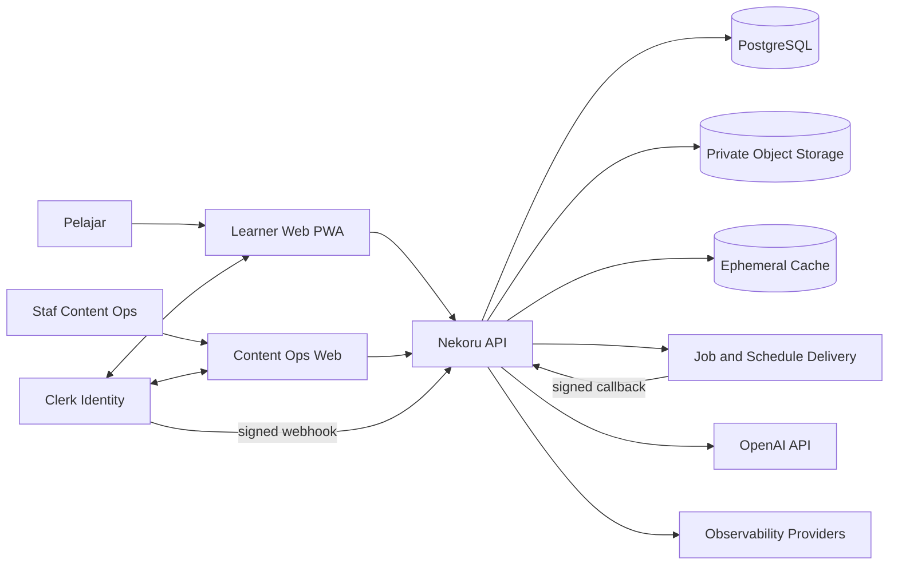
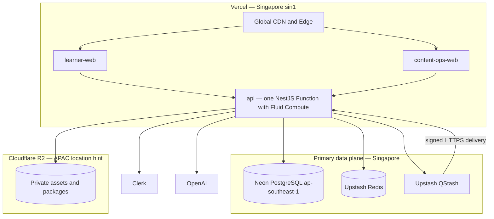
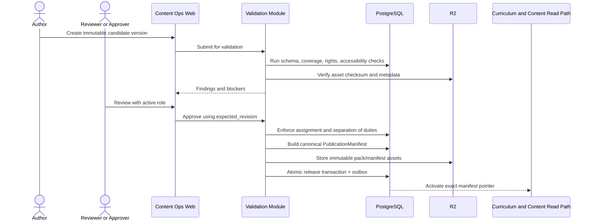
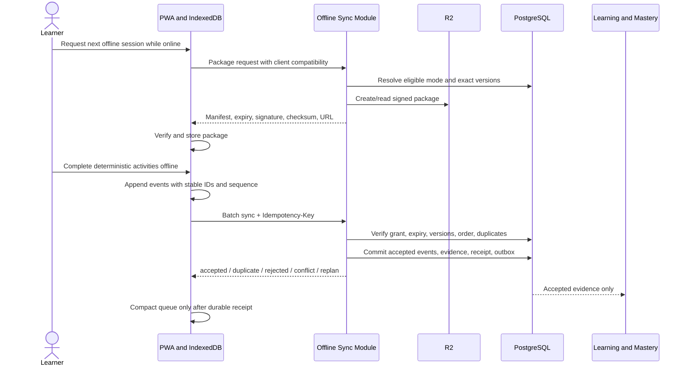

# Technical Architecture Nekoru — MVP N5 dan Jalur Evolusi

| Atribut | Nilai |
|---|---|
| Status | Draft v0.1 |
| Tanggal | 13 September 2026 |
| Pemilik | Engineering |
| Cakupan | MVP pemula absolut sampai JLPT N5; jalur evolusi N4–N1 |
| Audiens | Product, Engineering, Content, Learning Science, Design, QA, Security, dan Operations |

## 1. Tujuan dan status keputusan

Dokumen ini menerjemahkan spesifikasi produk, kurikulum, mesin belajar, asesmen, konten, serta UI/UX Nekoru menjadi arsitektur teknis yang dapat diimplementasikan. Arsitektur mengutamakan konsistensi keputusan akademik, keterlacakan bukti belajar, aksesibilitas, biaya operasional awal yang rendah, serta batas modul yang cukup kuat untuk tumbuh tanpa memulai dengan microservices.

Dokumen ini normatif untuk struktur sistem dan kontrak integrasi. Dokumen domain tetap menjadi sumber kebenaran untuk kebijakan akademik dan isi kurikulum. Bila nilai kebijakan akademik belum disetujui, sistem harus gagal secara tertutup (*fail closed*); arsitektur tidak boleh mengarang nilai pengganti.

### 1.1 Prinsip utama

1. **PostgreSQL adalah sumber kebenaran bisnis.** Redis, QStash, cache browser, dan keluaran AI tidak pernah menjadi otoritas akademik atau histori final.
2. **Keputusan harus dapat direproduksi.** Setiap hasil mengunci input, versi kurikulum, konten, kebijakan, evaluator, dan manifest yang tepat serta memiliki hash keputusan.
3. **Riwayat bukti tidak ditulis ulang.** Koreksi dilakukan dengan event baru yang menggantikan (*supersede*) atau mengadjudikasi event sebelumnya.
4. **Modular monolith lebih dahulu.** Transaksi kritis tetap lokal di satu aplikasi dan satu cluster PostgreSQL. Ekstraksi service hanya dilakukan setelah kebutuhan nyata terbukti.
5. **AI dibatasi sebagai pemberi kandidat.** AI dapat membantu evaluasi, diagnosis, dan umpan balik, tetapi tidak memiliki kewenangan atas kunci jawaban, KC, prerequisite, mastery, gate, progression, atau readiness.
6. **Online-first dengan jalur offline terkendali.** Aktivitas objektif dapat dijalankan secara offline setelah paket tervalidasi; asesmen berdampak tinggi tetap online-only.
7. **Aksesibilitas adalah batas sistem.** Kontrak konten, komponen, input, audio, fokus, bahasa, dan pengujian aksesibilitas diperlakukan sebagai persyaratan rilis.

### 1.2 Batas dan asumsi yang disetujui

- MVP mencakup pemula absolut hingga N5. N4–N1 ditambahkan melalui profil, inventory, blueprint, policy, dan migrasi berversi—bukan melalui fork logika N5.
- Guest onboarding draft disimpan paling lama tujuh hari dan dimigrasikan secara aman setelah autentikasi.
- Content Operations memakai satu workspace, mendukung staf dengan beberapa role, dan mencatat active role pada setiap tindakan.
- Internal preview tidak menghasilkan evidence. Free practice hanya tersedia bila policy menyatakan aktivitas tersebut eligible.
- Reminder MVP hanya in-app. Email hanya digunakan oleh Clerk untuk autentikasi.
- Durasi retensi raw response, telemetry, audit, dan backup belum ditetapkan. Sistem menyediakan TTL yang dapat dikonfigurasi, deletion, export, legal hold, dan purge job; persetujuan Privacy/Legal menjadi release blocker.
- Requiredness 900 Vocabulary, accommodation asesmen, dan keputusan akademik lain yang belum selesai tetap fail-closed.
- [`assessment-specification-n5.md`](./assessment-specification-n5.md) adalah sumber aktif. Pernyataan “belum tersedia” dalam [`content-validation-rubric.md`](./content-validation-rubric.md) sudah usang dan tidak digunakan sebagai dasar implementasi.
- [`docs/design/nekoru.pen`](../design/nekoru.pen) kosong pada saat dokumen ini dibuat sehingga tidak menjadi sumber keputusan arsitektur.

## 2. Kualitas yang diprioritaskan

Urutan prioritas berikut dipakai ketika terjadi trade-off:

1. Integritas keputusan akademik dan tidak adanya bukti/score ganda.
2. Keamanan, privasi, dan pembatasan akses staf.
3. Reproduksibilitas, auditabilitas, dan kemampuan koreksi tanpa merusak histori.
4. Ketersediaan journey belajar objektif tanpa ketergantungan AI.
5. Aksesibilitas dan penggunaan mobile pada koneksi lambat.
6. Kemudahan operasi dan biaya MVP.
7. Skalabilitas horizontal dan pemisahan service di masa depan.

Target operasional awal berikut adalah baseline teknis, bukan kebijakan produk final:

| Indikator | Target awal | Catatan |
|---|---:|---|
| Availability learner core | 99,5% per bulan | Tidak termasuk maintenance yang diumumkan; harus dikonfirmasi sebelum production |
| p95 read API | < 500 ms | Tidak termasuk transfer asset |
| p95 deterministic mutation | < 800 ms | Tidak termasuk evaluasi AI |
| Feedback aktivitas objektif | < 1 detik | Setelah submission diterima server atau evaluator lokal selesai |
| Outbox delivery lag normal | < 10 detik | Sweeper pemulihan menargetkan < 60 detik |
| RPO / RTO usulan | ≤ 1 jam / ≤ 4 jam | Wajib divalidasi terhadap kemampuan plan vendor dan restore drill |

## 3. System context



Pelajar hanya berinteraksi dengan learner surface. Staf hanya berinteraksi dengan Content Operations surface. Kedua web app berbagi design tokens dan kontrak, tetapi bundle, routing, kebijakan akses, dan deployment dipisahkan agar area internal tidak ikut terkirim ke perangkat learner.

## 4. Arsitektur container dan deployment

### 4.1 Struktur monorepo

```text
apps/
  learner-web/          # Next.js PWA, mobile-first
  content-ops-web/      # Next.js, desktop-first
  api/                  # NestJS + Fastify modular monolith
packages/
  ui/                   # design tokens dan primitive lintas surface
  contracts/            # DTO, Zod schema, event, dan OpenAPI helpers
  domain/               # value object dan algoritme deterministik murni
  policies/             # policy schema dan loader versi
  content-schema/       # schema inventory, blueprint, asset, dan pack
  testing/              # fixtures, factories, contract harness
  telemetry/            # logging, tracing, metric conventions
tooling/
  eslint-config/
  typescript-config/
  scripts/
```

Workspace menggunakan `pnpm`, Turborepo, dan TypeScript strict end-to-end. Package domain tidak boleh bergantung pada framework, database, provider AI, atau browser API. Dependency bergerak dari adapter ke application/domain, bukan sebaliknya.

### 4.2 Topologi deployment



### 4.3 Pilihan platform

| Komponen | Pilihan | Alasan dan batas |
|---|---|---|
| Learner web | Next.js PWA di Vercel | Mobile-first, installable, cache shell, IndexedDB, dan deployment terpisah |
| Content Ops | Next.js di Vercel | Desktop-first, tidak memasukkan kode internal ke learner bundle |
| API | NestJS + Fastify di Vercel | Modular monolith dalam satu Vercel Function dengan Fluid Compute; tidak mengandalkan proses resident |
| Database | Neon PostgreSQL Singapore | Sumber kebenaran transaksional; Drizzle ORM, SQL migration, serverless/pooled connection |
| Object storage | Cloudflare R2 private bucket, APAC hint | Asset, animasi, audio, content pack, offline package, dan export; akses presigned dan checksum |
| Cache | Upstash Redis Singapore | Cache, rate limit, dan koordinasi sementara saja |
| Job delivery | Upstash QStash | Push job, schedule, retry, dan dead-letter handling; consumer selalu idempotent |
| Identity | Clerk | Authentication/session; authorization Nekoru tetap di backend |
| AI | OpenAI melalui internal adapter | Structured Outputs, versioning, audit, timeout, dan deterministic fallback |

Pemilihan Singapore berlaku jika produk/vendor menyediakan lokasi tersebut. Penyimpangan region harus melalui review privasi, latensi, dan residency serta dicatat sebagai decision log.

## 5. Bounded modules

Semua modul hidup dalam satu deployable API, tetapi mempunyai application service, domain model, database schema, repository interface, event contract, dan test boundary sendiri.

| Modul | Tanggung jawab | PostgreSQL schema | Tidak boleh mengambil alih |
|---|---|---|---|
| Identity and Access | User mirror, allowlist, role, permission, assignment, active role, SoD | `iam` | Identity/session Clerk |
| Learner Profile | Profile, timezone, locale, preference, onboarding migration | `learner` | Curriculum atau mastery calculation |
| Curriculum | Versioned level/profile, KC, prerequisite, inventory, blueprint | `curriculum` | Authoring workflow |
| Content Bank and Assets | Artifact, item, asset metadata, rights, version | `content` | Approval atau publication decision |
| Validation and Release | Review, issue, quarantine, approval, manifest, rollback target | `validation` | Mengubah published version in-place |
| Practice | Session plan, run, activity, submission, deterministic evaluation | `practice` | Menetapkan mastery langsung |
| Learning and Mastery | Evidence ledger, KC state, readiness, gate, replanning | `learning` | Menilai jawaban tanpa evaluation result |
| Assessment | Form, run, timer, response, scoring, result, adjudication | `assessment` | Mengubah curriculum/answer key |
| Gamification | XP/achievement/progress presentation derived from accepted events | `gamification` | Menjadi sumber progression akademik |
| Notification | In-app reminder dan preference | `notification` | Mengirim email produk pada MVP |
| Offline Sync | Package grant, device/session state, receipt, conflict resolution | `offline_sync` | Menjadi sumber evidence sebelum ack |
| Audit | Immutable staff/system decision log dan access trail | `audit` | Generic analytics |
| Analytics | Privacy-filtered domain events, aggregates, export state | `integration` | Raw answer atau sumber keputusan |

### 5.1 Aturan interaksi modul

- Query lintas modul berjalan melalui application interface, bukan membaca tabel schema lain secara bebas.
- Operasi kritis yang memerlukan konsistensi kuat dapat memakai satu transaksi PostgreSQL dan repository terkoordinasi.
- Efek samping nonkritis dipublikasikan melalui transactional outbox.
- Tidak ada foreign key lintas service karena belum ada service terpisah; foreign key lintas schema boleh dipakai untuk menjaga integritas selama ownership tetap jelas.
- Event publik modul bersifat berversi. Consumer tidak mengandalkan bentuk tabel internal producer.
- Analytics dan gamification mengonsumsi accepted events; keduanya tidak dapat mengubah status akademik.

## 6. Data architecture

### 6.1 Source-of-truth matrix

| Data | Sumber kebenaran | Salinan/derivasi | Aturan |
|---|---|---|---|
| Identity dan session | Clerk | `iam.user_identity` sebagai mirror | Clerk ID dipetakan ke internal learner/staff ID |
| Authorization, allowlist, assignment, SoD | PostgreSQL `iam` | Redis cache singkat | Backend selalu memverifikasi policy; cache dapat dibuang |
| Curriculum, KC, prerequisite, inventory | PostgreSQL `curriculum` | Signed/versioned pack di R2 | Published version immutable |
| Content metadata, answer key, rights | PostgreSQL `content` | Release manifest dan pack | Answer key tidak dikirim sebelum diizinkan policy |
| Binary asset | R2 private bucket | Browser cache setelah validasi | PostgreSQL menyimpan object key, hash, MIME, size, rights, status |
| Practice dan assessment records | PostgreSQL | Client working state | Server menjadi final authority |
| Evidence dan mastery | PostgreSQL `learning` | Read model/cache | Evidence immutable; mastery dapat direbuild |
| Job status/histori | PostgreSQL outbox/inbox | QStash delivery state | QStash bukan job ledger |
| Cache/rate limit | Redis | Tidak ada | Kehilangan cache tidak boleh merusak kebenaran |
| AI candidate output | PostgreSQL evaluation/audit sesuai policy | OpenAI response sementara | Tidak memiliki otoritas akademik |
| Analytics | Privacy-filtered events/aggregate | Dashboard/export | Tidak berisi raw answer pada generic stream |

### 6.2 Identitas, waktu, dan versioning

- Semua ID memakai prefixed ULID, misalnya `lrn_`, `kc_`, `cnt_`, `prun_`, `sub_`, `evd_`, `arun_`, dan `evt_`. Prefix membantu diagnosis; ULID memberi urutan waktu tanpa menjadi pengganti timestamp.
- Waktu disimpan sebagai UTC. Event menyimpan `occurred_at` dari sumber dan `received_at` dari server. UI merender waktu memakai IANA timezone profile, misalnya `Asia/Jakarta`.
- Setiap aggregate mutable memiliki integer `revision`. Mutation relevan wajib membawa `expected_revision`; mismatch menghasilkan `409 Conflict`, bukan last-write-wins.
- Referensi akademik selalu menyimpan exact `curriculum_version`, `content_version`, `policy_version`, `evaluator_version`, dan bila relevan `manifest_hash`.
- Canonical payload memakai serialisasi JSON deterministik: key terurut, timestamp UTC ISO-8601, angka dengan representasi yang disepakati, dan tanpa field nondeterministik. SHA-256 payload canonical menghasilkan `decision_hash` atau `manifest_hash`.
- Published content immutable. Perubahan substantif, answer key, KC mapping, rubric, rights, atau accessibility metadata menghasilkan versi baru.

### 6.3 Immutable events, outbox, dan inbox

Dalam transaksi yang sama dengan perubahan domain, API menulis event ke `integration.outbox`. Setelah commit, publisher mencoba mengirim event ke QStash. Schedule sweeper membaca outbox yang belum terkonfirmasi dan menerbitkannya kembali. Consumer memverifikasi signature QStash, lalu mencatat stable idempotency key di `integration.inbox` sebelum efek domain diterapkan.

Koreksi evidence, score, atau keputusan tidak mengubah record lama. Event koreksi memiliki `supersedes_event_id`, alasan, aktor, timestamp, dan decision hash baru. Read model memilih rantai keputusan terbaru yang valid, sedangkan audit tetap dapat merekonstruksi seluruh histori.

Stable idempotency key dibentuk dari namespace operasi dan identifier yang tidak berubah, misalnya `practice-submission:{submission_id}` atau `clerk-webhook:{provider_event_id}`. Hash body saja tidak cukup karena dua tindakan sah dapat memiliki body sama.

### 6.4 Cache policy

| Data | Cache | TTL/invalidasi | Perilaku saat cache gagal |
|---|---|---|---|
| Published curriculum/content read model | Redis + HTTP cache | Versi immutable dapat panjang; pointer aktif invalidasi saat release | Baca PostgreSQL |
| Authorization | Redis singkat | Invalidasi pada perubahan role/allowlist; backend mengecek revision | Baca PostgreSQL dan default deny |
| Rate limit | Redis | Sliding/fixed window per route dan identity/IP | Endpoint sensitif fail closed; learner core memakai batas konservatif lokal bila aman |
| Signed URL metadata | Redis opsional | Lebih pendek dari URL expiry | Buat ulang dari metadata PostgreSQL |
| Mastery/readiness read model | Redis opsional | Key memuat learner dan revision | Recompute/read PostgreSQL |
| Draft/run aktif | Tidak sebagai authority | Redis hanya akselerator | Pulihkan dari PostgreSQL atau client receipt |

Cache key selalu menyertakan tenant/workspace bila kelak ditambahkan, aggregate ID, dan version/revision. Data lintas role tidak berbagi response cache.

## 7. Kontrak API dan integrasi

### 7.1 Konvensi HTTP

- Base path: `/api/v1`.
- Format: REST JSON; OpenAPI menjadi kontrak publik internal dan dihasilkan dari schema bersama.
- Validasi request/response: Zod schema dari `packages/contracts` pada boundary web dan API.
- Error: RFC 7807-style `application/problem+json` dengan `type`, `title`, `status`, `detail`, `instance`, `code`, `correlation_id`, dan validation fields bila relevan.
- Authentication: `Authorization: Bearer <Clerk token>`; authorization selalu dilakukan backend.
- Correlation: client boleh mengirim `X-Correlation-ID`; server memvalidasi atau membuat ID baru dan selalu mengembalikannya.
- Idempotency: mutation yang dapat diulang wajib membawa `Idempotency-Key`. Server menyimpan scope, request fingerprint, status, dan response final.
- Concurrency: mutation aggregate penting membawa `expected_revision`; response sukses mengembalikan revision baru.
- Pagination: cursor opaque dan stable ordering; tidak memakai page number untuk histori yang terus bertambah.
- Versioning: breaking change memakai versi path baru; additive field tidak mengubah `/v1`.

Contoh problem response:

```json
{
  "type": "https://docs.nekoru.app/problems/stale-revision",
  "title": "Revision sudah berubah",
  "status": 409,
  "detail": "Data telah diperbarui sejak terakhir dibaca.",
  "instance": "/api/v1/content-ops/artifacts/cnt_01...",
  "code": "STALE_REVISION",
  "correlation_id": "cor_01...",
  "current_revision": 8
}
```

### 7.2 Kelompok endpoint

| Area | Endpoint representatif | Catatan |
|---|---|---|
| Profile/onboarding | `GET/PATCH /profile`, `POST /onboarding/migrate-guest-draft` | Migrasi idempotent, draft client expiry tujuh hari |
| Learning plan/session | `GET /learning-plans/current`, `POST /session-plans`, `POST /sessions/{id}/start` | Mengunci VersionSet dan policy |
| Practice | `POST /practice-runs`, `POST /practice-runs/{id}/submissions`, `POST /practice-runs/{id}/complete` | Objective evaluation sinkron dan deterministik |
| Offline sync | `POST /offline-packages`, `POST /sync/practice-events`, `GET /sync/receipts/{id}` | Package signed; batch menerima per-event status |
| Mastery/readiness | `GET /mastery`, `GET /readiness`, `POST /readiness/recalculate` | Readiness diturunkan dari evidence/policy terkunci |
| Assessment | `POST /assessments/runs`, `POST /assessments/runs/{id}/responses`, `POST /assessments/runs/{id}/submit` | Online-only, timer server-authoritative |
| Content artifacts | `GET/POST /content-ops/artifacts`, `PATCH /content-ops/artifacts/{id}` | Exact role, assignment, expected revision |
| Review/release | `POST /content-ops/reviews`, `POST /content-ops/releases`, `POST /content-ops/releases/{id}/rollback` | SoD dan preflight blockers |
| Issue/quarantine | `POST /content-ops/issues`, `POST /content-ops/artifacts/{id}/quarantine` | Pemilihan run baru langsung mengecualikan quarantine |
| Audit | `GET /content-ops/audit`, `GET /content-ops/decisions/{id}` | Least privilege dan export tercatat |

Daftar ini mendefinisikan kelompok dan invariants, bukan menggantikan OpenAPI terperinci yang dibangun bersama implementasi.

### 7.3 Webhook dan job callback

Endpoint provider dipisahkan dari public API:

- `POST /webhooks/clerk`: verifikasi signature terhadap raw body, validasi timestamp/replay window, simpan provider event ID di inbox, lalu upsert identity mirror secara idempotent.
- `POST /jobs/qstash/{job_type}`: verifikasi QStash signature, audience/URL, body, dan delivery identifier; consumer mencatat receipt sebelum menjalankan efek.

Webhook tidak memiliki akses implicit ke seluruh application service. Setiap handler dipetakan ke command yang diizinkan. Kegagalan permanen masuk dead-letter workflow dan memunculkan alert; retry tidak boleh menghasilkan duplicate evidence, score, publication, atau notification.

Onboarding tidak bergantung pada webhook Clerk yang akhirnya konsisten. Setelah token berhasil diautentikasi, API dapat membuat atau menyelaraskan internal identity secara sinkron dan aman; webhook tetap menangani pembaruan berikutnya.

## 8. Kontrak domain utama

Kontrak berikut adalah envelope integrasi minimal. Field pedagogis lengkap tetap mengikuti dokumen domain pemiliknya.

### 8.1 Referensi versi

```ts
type VersionSet = {
  curriculumVersion: string;
  contentReleaseId: string;
  contentManifestHash: string;
  policyVersion: string;
  evaluatorVersion: string;
  schemaVersion: string;
};
```

Session, content pack, assessment form, evaluation, evidence, mastery decision, dan publication selalu menunjuk VersionSet atau subset eksplisit yang cukup untuk reproduksi.

### 8.2 Practice dan evaluation

```ts
type PracticeRun = {
  id: `prun_${string}`;
  learnerId: `lrn_${string}`;
  sessionPlanId: string;
  mode: "introduction" | "guided" | "independent" | "free" | "review" | "remedial";
  versionSet: VersionSet;
  source: "online" | "offline-package";
  startedAt: string;
  completedAt?: string;
  revision: number;
};

type ActivityInstance = {
  id: `act_${string}`;
  runId: `prun_${string}`;
  contentItemId: string;
  contentVersion: string;
  kcIds: string[];
  presentationSeed: string;
  ordinal: number;
};

type Submission = {
  id: `sub_${string}`;
  activityInstanceId: `act_${string}`;
  clientEventId: string;
  occurredAt: string;
  receivedAt?: string;
  answerPayload: unknown;
  answerPayloadHash: string;
  attemptOrdinal: number;
};

type EvaluationResult = {
  id: string;
  submissionId: `sub_${string}`;
  status: "correct" | "incorrect" | "partial" | "pending" | "invalid";
  method: "deterministic" | "ai-candidate" | "human-adjudication";
  score?: number;
  diagnosisCodes: string[];
  feedbackRef?: string;
  versionSet: VersionSet;
  decisionHash: string;
};
```

`presentationSeed` memastikan input dan versi yang sama menghasilkan urutan dan variasi yang sama. `answerPayload` hanya tersedia pada boundary yang berwenang dan tidak disalin ke generic logs/analytics.

### 8.3 Evidence, mastery, dan readiness

```ts
type EvidenceEvent = {
  id: `evd_${string}`;
  learnerId: `lrn_${string}`;
  kcId: `kc_${string}`;
  sourceType: "practice" | "assessment" | "adjudication";
  sourceId: string;
  result: "positive" | "negative" | "neutral" | "pending";
  weightPolicyRef: string;
  occurredAt: string;
  receivedAt: string;
  supersedesEventId?: `evd_${string}`;
  decisionHash: string;
};

type LearnerKCState = {
  learnerId: `lrn_${string}`;
  kcId: `kc_${string}`;
  state: string;
  evidenceCursor: string;
  policyVersion: string;
  computedAt: string;
  decisionHash: string;
  revision: number;
};
```

Mastery dan readiness adalah read model deterministik dari accepted evidence dan policy version. Bila requiredness, gate, atau coverage policy tidak lengkap, readiness mengembalikan status `blocked_policy_incomplete`, bukan asumsi kelulusan.

### 8.4 Assessment

```ts
type AssessmentRun = {
  id: `arun_${string}`;
  learnerId: `lrn_${string}`;
  formId: string;
  formVersion: string;
  manifestHash: string;
  startedAtServer: string;
  deadlineAtServer: string;
  deviceLeaseId: string;
  status: "active" | "submitted" | "expired" | "technical-review" | "scored";
  revision: number;
};

type AssessmentResult = {
  id: string;
  runId: `arun_${string}`;
  scoringPolicyVersion: string;
  scoreSummary: Record<string, number>;
  decision: string;
  feedbackReleaseAt?: string;
  decisionHash: string;
  supersedesResultId?: string;
};
```

Form mengunci item/version, section, ordering seed, timer, scoring policy, dan manifest hash. Client tidak menerima answer key atau feedback yang ditahan. Technical failure tidak boleh dikonversi menjadi jawaban salah.

### 8.5 Content operations dan publication

```ts
type ContentReview = {
  id: string;
  artifactId: string;
  artifactVersion: string;
  rubricVersion: string;
  reviewerId: string;
  activeRole: string;
  findings: Array<{ code: string; severity: string; fieldRef?: string }>;
  decision: "changes-requested" | "approved" | "rejected";
  revision: number;
};

type PublicationManifest = {
  id: string;
  releaseId: string;
  curriculumVersion: string;
  artifacts: Array<{ id: string; version: string; sha256: string }>;
  assets: Array<{ objectKey: string; sha256: string; bytes: number }>;
  policies: Record<string, string>;
  createdAt: string;
  manifestHash: string;
  previousManifestHash?: string;
};

type DecisionLog = {
  id: string;
  decisionType: string;
  actorType: "staff" | "system" | "provider";
  actorId: string;
  activeRole?: string;
  inputRefs: string[];
  policyRefs: string[];
  outcome: string;
  occurredAt: string;
  correlationId: string;
  decisionHash: string;
};
```

Author tidak boleh menjadi satu-satunya approver untuk artifact/release yang sama. Release bersifat atomik: pointer aktif hanya berubah setelah semua blocker, approval, rights, asset, manifest, compatibility, dan rollback target lolos.

### 8.6 Offline sync receipt

```ts
type OfflineSyncReceipt = {
  id: string;
  learnerId: `lrn_${string}`;
  deviceId: string;
  packageId: string;
  packageManifestHash: string;
  accepted: string[];
  duplicates: string[];
  rejected: Array<{ clientEventId: string; code: string }>;
  conflicts: Array<{ clientEventId: string; serverRevision: number; action: string }>;
  replanRequired: boolean;
  receivedAt: string;
  receiptHash: string;
};
```

Client baru menandai event sebagai evidence final setelah receipt server. Receipt dapat diminta ulang memakai idempotency key yang sama.

## 9. Aliran kritis

### 9.1 Practice sampai mastery

```mermaid
sequenceDiagram
    actor L as Learner
    participant W as Learner Web
    participant P as Practice Module
    participant E as Evaluator
    participant DB as PostgreSQL
    participant M as Learning and Mastery
    participant Q as QStash

    L->>W: Submit activity
    W->>P: Submission + Idempotency-Key + expected_revision
    P->>DB: Lock run and deduplicate submission
    alt Objective item
        P->>E: Deterministic evaluation with locked versions
        E-->>P: EvaluationResult + decision_hash
        P->>DB: Commit submission, result, evidence, outbox
        P-->>W: Feedback and new revision
    else Semi-open item
        P->>E: Bounded AI candidate request
        alt Valid response within timeout
            E-->>P: Schema-valid candidate
            P->>DB: Commit result/evidence according to approved policy
            P-->>W: Feedback or pending-review state
        else Timeout, invalid, or low confidence
            P->>DB: Commit evaluation_pending and outbox
            P->>Q: Request asynchronous retry
            P-->>W: Pending without mastery penalty
        end
    end
    Q->>P: Signed idempotent retry callback
    P->>DB: Append result/evidence; never overwrite history
    DB-->>M: Outbox event
    M->>DB: Recompute KC state/readiness deterministically
```

Untuk item objektif, submission, evaluation, evidence, dan outbox dapat disimpan dalam satu transaksi. Untuk semi-open, status pending bersifat netral sampai candidate valid atau adjudication tersedia. Kegagalan OpenAI tidak boleh menghentikan objective practice.

### 9.2 Content publication



Quarantine setelah publication mencegah content dipilih untuk run baru. Run yang sudah terkunci mempertahankan referensi historis, dan quarantine tidak memberi hukuman retroaktif kepada learner. Jika masalah memengaruhi score/evidence, adjudication eksplisit membuat event superseding.

### 9.3 Assessment

```mermaid
sequenceDiagram
    actor L as Learner
    participant W as Learner Web
    participant A as Assessment Module
    participant DB as PostgreSQL
    participant T as Server Clock

    L->>W: Start assessment
    W->>A: Create run
    A->>DB: Lock form version, manifest, device lease, policy
    A->>T: Establish server deadline
    A-->>W: Run without answer key + deadline
    loop Responses
        W->>A: Save response + sequence + expected_revision
        A->>T: Validate server time
        A->>DB: Idempotent append/update working response
        A-->>W: Receipt + new revision
    end
    W->>A: Submit run
    A->>T: Validate deadline
    A->>DB: Atomically finalize, score, evidence, outbox
    A-->>W: Submission receipt; feedback held by policy
```

Assessment N5 mengikuti blueprint aktif, single-device lease, server-authoritative timer, exact locked manifest, dan feedback hold. Placement, checkpoint, verification, simulation, serta assessment berdampak tinggi lain tidak tersedia offline. Pergantian perangkat memerlukan recovery flow server, bukan dua run aktif.

### 9.4 Offline synchronization



Paket offline adalah artifact signed dan immutable yang memuat manifest exact version, expiry, compatibility range, checksum, serta aktivitas yang dapat dievaluasi lokal secara deterministik. Browser memakai IndexedDB append-only queue. Expiry, signature, checksum, atau incompatibility yang gagal menghentikan eksekusi; client tidak meng-upgrade paket diam-diam.

Conflict resolution bersifat domain-specific. Duplicate diakui tanpa efek kedua; stale plan dapat diterima sebagai evidence historis bila policy mengizinkan tetapi memicu replan; perubahan policy yang membuat event tidak sah menghasilkan rejection yang transparan, bukan last-write-wins.

## 10. AI evaluation boundary

Semua akses OpenAI melewati `AiEvaluationAdapter`; modul domain tidak mengimpor SDK provider.

### 10.1 Kontrak dan batasan

- Gunakan OpenAI Responses API dengan JSON Schema Structured Outputs untuk candidate evaluation yang tervalidasi.
- Request hanya membawa teks learner yang diperlukan, rubric/reference answer yang telah disetujui, language context, dan opaque correlation ID. Jangan mengirim profile lengkap atau histori yang tidak relevan.
- Adapter mengunci `provider`, `model_config_id`, model identifier, prompt version, schema version, rubric version, dan evaluator version. Perubahan salah satunya membuat evaluator version baru.
- Objective items memakai evaluator lokal; OpenAI tidak dipanggil.
- AI tidak menerima tool atau akses network dalam evaluasi dan tidak dapat menulis database secara langsung.
- Timeout, schema failure, refusal, provider error, atau confidence di bawah policy menghasilkan `pending`, bukan jawaban salah dan bukan mastery penalty.
- Retry dijalankan melalui QStash dengan idempotency key. Setelah batas retry, item masuk adjudication/operational queue.
- Static feedback dan deterministic diagnosis menjadi fallback untuk aktivitas objektif.
- Keputusan penyimpanan provider dan retensi payload harus mengikuti privacy policy yang disetujui. Adapter mengekspos konfigurasi, audit metadata, deletion/export hooks, dan redaction tanpa menetapkan durasi sendiri.

### 10.2 Pemisahan kewenangan

| AI boleh mengusulkan | AI tidak boleh menetapkan/mengubah |
|---|---|
| Kandidat correctness untuk semi-open | Answer key atau acceptable-answer canonical |
| Diagnosis code dari daftar tertutup | KC mapping atau prerequisite graph |
| Feedback dari template/constraint | Mastery state atau evidence weight |
| Confidence dan alasan terstruktur | Gate, progression, readiness, atau assessment pass/fail |

Output AI baru memiliki efek setelah schema validation, policy evaluation, version capture, dan pencatatan decision hash oleh Nekoru.

## 11. Security dan privacy

### 11.1 Identity dan authorization

- Learner dapat memakai Google atau email magic link melalui Clerk.
- Content Ops hanya menerima Google identity dengan email terverifikasi yang cocok exact dengan staff allowlist aktif. Tidak ada self-registration internal.
- API memvalidasi token, issuer, audience/authorized party, expiry, dan session state. CORS memakai daftar origin exact per environment.
- Permission, role, assignment, active role, dan separation of duties dibaca dari PostgreSQL. Client-side guard hanya untuk UX.
- Multi-role staff memilih active role; role, assignment, target, alasan, dan correlation ID dicatat pada audit log.
- Author tidak dapat menjadi satu-satunya approver. Emergency override, bila kelak disetujui, memerlukan permission khusus, alasan wajib, dual review retrospektif, dan alert.

### 11.2 Proteksi data dan asset

- TLS dipakai untuk semua jalur. Encryption at rest mengikuti fasilitas vendor; secret dipisah per environment dan tidak masuk repository atau client bundle.
- R2 bucket private. Object key immutable menyertakan version/hash; presigned URL berumur pendek dan dibatasi pada object/method yang diperlukan.
- API memverifikasi MIME, ukuran, SHA-256, rights metadata, dan status quarantine sebelum menerbitkan asset.
- HTML/SVG content disanitasi dengan allowlist; external URL, script, event handler, dan `foreignObject` ditolak. Rich text dirender dengan komponen terkendali.
- Answer key, unreleased explanation, hidden rubric, dan assessment feedback yang ditahan tidak dikirim ke client.
- Generic log dan analytics tidak memuat raw answer, magic link, token, presigned URL penuh, atau payload AI. Akses raw learner response, internal note, audit export, dan adjudication memakai least privilege dan access audit.
- Tidak ada proctoring invasif kamera/mikrofon dan tidak ada perekaman audio learner pada MVP.
- Rate limit diterapkan per identity, device, IP risk bucket, dan route; endpoint login/provider tetap mengikuti proteksi Clerk.

### 11.3 Retention dan data subject operations

Setiap kelas data memiliki `retention_policy_key`, TTL opsional, legal-hold flag, deletion state, dan purge audit. Sistem menyediakan:

- export learner data yang terotorisasi;
- deletion/anonymization workflow yang mempertahankan kewajiban audit minimum sesuai policy;
- legal hold yang mencegah purge dan selalu diaudit;
- purge job idempotent untuk PostgreSQL, R2, cache, dan provider yang relevan;
- preview dampak dan approval untuk purge sensitif.

Durasi konkret untuk raw response, telemetry, audit, backup, dan AI trace merupakan release blocker sampai Privacy/Legal menyetujuinya.

## 12. Reliability, consistency, dan fallback

### 12.1 Consistency boundaries

| Operasi | Boundary konsistensi | Efek asynchronous |
|---|---|---|
| Objective submission | Submission + evaluation + evidence + outbox dalam satu transaksi | Mastery read model dapat dihitung segera atau dari event |
| Semi-open submission | Submission + pending result + outbox | AI retry/adjudication menambah result/evidence baru |
| Assessment submit | Finalize run + locked responses + score/result + evidence + outbox | Dashboard/notification |
| Publication | Approval + manifest record + active pointer + outbox atomik | Cache invalidation, pack warming |
| Quarantine | Status + reason + outbox atomik | Cache purge, impact analysis |
| Offline sync batch | Per-event dedupe + accepted evidence + durable receipt | Replan dan analytics |
| Role/allowlist change | PostgreSQL commit | Cache invalidation; default deny saat ragu |

### 12.2 Fallback matrix

| Kondisi | Perilaku wajib | Dilarang |
|---|---|---|
| OpenAI timeout/error | Objective tetap berjalan; semi-open menjadi pending dan retry/adjudication | Menandai salah atau memberi mastery penalty |
| Policy/version hilang | Blok session/release/decision terkait dengan kode eksplisit | Mengambil versi “terdekat” atau default tersembunyi |
| Duplicate submit/webhook/job/offline event | Kembalikan receipt/response terdahulu | Membuat attempt, score, evidence, atau publication kedua |
| Stale revision | `409` + current revision + recovery metadata | Last-write-wins |
| Asset/audio gagal | Tawarkan retry dan alternate accessible representation bila disetujui; catat technical issue | Menghukum learner |
| R2 unavailable | Published metadata/read nonasset dapat berjalan bila aman; aktivitas wajib asset ditunda | Mengganti asset tanpa checksum/version |
| Neon unavailable | Tampilkan status sementara dan pertahankan queue lokal yang aman | Menganggap write sukses tanpa durable receipt |
| Redis unavailable | Bypass cache ke PostgreSQL; endpoint sensitif fail closed bila rate limit tak aman | Menjadikan cached value sebagai authority |
| QStash retry/DLQ | Outbox tetap pending; sweeper/alert dan replay terkontrol | Menghapus histori job atau menjalankan efek non-idempotent |
| Offline package invalid/expired | Blok eksekusi/sync, jelaskan refresh/replan | Silent upgrade atau menerima evidence tak kompatibel |
| Quarantined content | Jangan pilih untuk run baru; lakukan impact analysis | Penalti retroaktif otomatis |
| Assessment technical failure | Simpan recovery state atau technical review | Menghitung sebagai incorrect |

## 13. Observability dan operasi

### 13.1 Telemetry

- OpenTelemetry menjadi konvensi trace/metric; Sentry menangkap error aplikasi; Vercel Observability/logs serta metric Neon, R2, dan Upstash melengkapi diagnosis provider.
- Structured log memuat `correlation_id`, actor/internal ID, active role, module, route, run/event/decision ID, version refs, outcome code, latency, dan retry count—tanpa payload sensitif.
- Trace menghubungkan web request, API command, PostgreSQL transaction, outbox event, QStash delivery, dan AI candidate dengan correlation ID yang sama.
- Metrics teknis meliputi error/latency/saturation, connection use, cache hit, outbox lag, retry/DLQ, signed URL failure, sync conflict, dan AI pending rate.
- Metrics domain meliputi coverage/blocker release, quarantine impact, practice completion, evidence lag, mastery transition, assessment technical issue, serta calibration drift. Analytics adalah observasi, bukan authority.

### 13.2 Dashboard dan alert

Minimum dashboard:

1. Learner journey health: start, session generation, submit, feedback, completion, sync.
2. Learning quality: evidence lag, unexpected state transition, pending evaluation, readiness blockers.
3. Assessment integrity: active runs, device conflicts, timer anomalies, technical reviews, feedback hold.
4. Content operations: validation queue, blocker age, SoD rejection, release status, quarantine impact.
5. Platform health: API, Neon, R2, Redis, QStash, Clerk webhook, OpenAI.

Alert harus actionable dan menunjuk runbook. P0 mencakup data corruption risk, duplicate academic effect, answer leakage, authorization bypass, failed publication rollback, database outage, serta sustained assessment failures.

### 13.3 Backup dan recovery

- Gunakan point-in-time recovery Neon sesuai plan production yang dipilih.
- Buat logical snapshot berkala untuk configuration, curriculum, policy, publication manifest, dan audit-critical metadata; simpan terenkripsi di R2 dengan immutable object key dan checksum.
- R2 object memakai content-addressed/versioned key sehingga overwrite tidak diperlukan.
- Restore ke environment terisolasi, verifikasi manifest/hash, rekonstruksi read model, dan bandingkan decision fixtures.
- Restore drill wajib sebelum production dan sekurang-kurangnya kuartalan setelah launch. Target RPO/RTO dan retention baru final setelah plan vendor serta Privacy/Legal disetujui.

## 14. PWA, aksesibilitas, dan internationalization

### 14.1 PWA online-first

- Service worker menyimpan application shell dan asset public/versioned yang diizinkan, tidak meng-cache authenticated API response secara generik.
- IndexedDB menyimpan guest draft, signed package, run working state, append-only event queue, dan durable sync receipt.
- Guest draft memiliki created/expiry timestamp, schema version, encryption/privacy classification, dan one-time migration marker. Setelah migrasi berhasil, salinan guest dibersihkan secara idempotent.
- UI memperlihatkan state online/offline, package expiry, queue count, last sync, conflict, dan kebutuhan replan dengan jelas.
- Next offline session dapat dipreload secara transparan saat online, tetapi learner tetap mendapat kontrol storage dan penghapusan.

### 14.2 Accessibility contract

- Target WCAG 2.2 AA pada kedua surface.
- Learner surface mendukung lebar 320 CSS px, zoom 200%, reflow 400%, keyboard-only, reduced motion, forced colors, dan koneksi lambat/reconnect.
- Komponen mempunyai semantic HTML, visible focus, accessible name/description/error, target size, dan urutan fokus yang stabil.
- Audio memiliki transcript/caption/alternate instruction sesuai blueprint; kegagalan audio tidak dihitung sebagai kesalahan learner.
- Teks Jepang memakai `lang="ja"`, UI Indonesia memakai `lang="id"`; furigana memakai semantic ruby bila tersedia. Input diuji dengan IME Jepang.
- Animasi kanji menyediakan pause/replay/reduced-motion representation dan tidak menjadi satu-satunya pembawa informasi.
- Design tokens dan primitives dibagi melalui `packages/ui`; pola learner dan Content Ops tetap dapat berbeda sesuai kebutuhan kognitif.

## 15. Testing strategy dan quality gates

### 15.1 Piramida pengujian

| Lapisan | Tool/pendekatan | Fokus |
|---|---|---|
| Static | TypeScript strict, ESLint, dependency boundary | Type safety, import direction, unsafe API |
| Unit | Vitest | Domain rules, deterministic evaluator, canonicalization, policy loader |
| Property/determinism | Generated fixtures + hash snapshots | Input/version sama menghasilkan output/hash sama |
| Contract | OpenAPI/Zod consumer-provider tests | Web/API, event, webhook, job, offline package |
| Integration | API + isolated Neon branch/database + provider fakes | Transaction, outbox/inbox, idempotency, migrations |
| End-to-end | Playwright | P0 learner dan Content Ops journeys |
| Accessibility automation | axe-core + Playwright | Baseline WCAG regressions |
| Manual accessibility | Keyboard, NVDA, VoiceOver, TalkBack, zoom/reflow, IME | Perilaku yang tidak cukup diuji otomatis |
| Failure/load | Fault injection dan load test | Provider timeout, retry, conflict, connection pressure |
| Content build | Schema/coverage/rights/asset validators | Release completeness dan reproducibility |

CI memakai database/branch terisolasi dan nonproduction provider atau deterministic fake. Secret production tidak tersedia di pull request build. Migration diuji forward, compatibility, dan restore; rollback schema hanya dipakai bila aman, sedangkan rollback content memakai manifest pointer sebelumnya.

### 15.2 Acceptance criteria arsitektur

Rilis tidak boleh lolos kecuali seluruh kriteria relevan berikut terbukti:

- Input dan seluruh version yang sama menghasilkan session, evaluation, mastery, assessment score, dan decision hash yang sama.
- Duplicate submit, webhook, QStash delivery, dan offline event tidak menghasilkan attempt, score, atau evidence ganda.
- Stale revision ditolak tanpa last-write-wins; correction dan adjudication tidak menulis ulang history.
- Objective practice tetap berjalan saat OpenAI gagal; semi-open response menjadi pending tanpa mastery penalty.
- Assessment mempertahankan locked manifest, timer server-authoritative, feedback hold, single-device rule, dan tidak mengirim answer key sebelum release.
- Quarantined content tidak dipilih untuk run baru dan tidak menghukum learner secara retroaktif.
- Clerk identity yang tidak allowlisted tidak memperoleh akses internal; author tidak dapat menjadi satu-satunya approver.
- Signed asset/offline package gagal dijalankan ketika expiry, signature, checksum, atau version compatibility tidak valid.
- Seluruh P0 journey diuji dengan Vitest, contract/integration tests, Playwright, axe-core, keyboard-only, NVDA, VoiceOver, TalkBack, zoom 200%, reflow 400%, IME Jepang, reduced motion, forced colors, slow network, dan reconnect.
- Release gagal jika required KC, content coverage, platform matrix, privacy retention policy, approval, rights, atau rollback target belum lengkap.

Failure injection minimum mencakup OpenAI timeout/invalid schema, duplicate delivery, stale revision, Neon interruption, R2/audio failure, QStash retry/DLQ, Clerk webhook replay, offline conflict, expired package, dan cache loss.

## 16. Delivery plan

### Fase 1 — Fondasi online

- Bangun monorepo, CI, environment isolation, shared contracts, telemetry conventions, dan migration workflow.
- Implementasikan Clerk authentication, identity mirror, learner profile, staff allowlist, RBAC, assignment, active role, dan audit dasar.
- Buat PostgreSQL schemas, ID/version/hash conventions, transactional outbox/inbox, dan idempotency store.
- Implementasikan curriculum/content read path, exact-version session planning, objective practice deterministik, evidence/mastery core, dan P0 learner journey online.
- Tambahkan source-of-truth dashboard dan runbook dasar.

Exit: learner terautentikasi dapat menyelesaikan session objektif online; hasil dapat direproduksi; duplicate tidak menambah evidence; role internal ditolak secara benar.

### Fase 2 — Workflow lengkap

- Implementasikan Content Operations authoring, validation, review, assignment, SoD, release manifest, quarantine, issue, dan rollback.
- Implementasikan assessment N5 sesuai specification aktif, readiness, locked form, server timer, scoring, feedback hold, dan adjudication.
- Tambahkan constrained OpenAI adapter untuk semi-open response, pending/retry flow, serta operational dashboards.
- Lengkapi coverage, calibration, audit export, dan content release preflight.

Exit: content dapat bergerak dari candidate ke publication atomik; assessment integrity tests lolos; kegagalan AI tidak memblokir objective journey.

### Fase 3 — Hardening MVP

- Implementasikan signed offline packages, IndexedDB queue, deterministic local evaluator, sync receipt, conflict recovery, dan replan.
- Selesaikan accessibility matrix, slow-network/reconnect, load/failure testing, backup restore drill, security review, dan production runbooks.
- Verifikasi calibration telemetry, alerting, retention configuration, data export/deletion, legal hold, dan purge jobs.
- Tutup seluruh release blocker kebijakan, platform, rights, coverage, privacy, dan accommodation.

Exit: acceptance criteria pada Bagian 15.2 lolos dan owner Product, Academic/Content, Engineering, Security/Privacy, Accessibility, serta Operations memberikan sign-off yang relevan.

### Fase 4 — Evolusi N4–N1

- Tambahkan level melalui versioned curriculum profiles, KC/prerequisite graph, inventory, blueprint, policy, assessment form, dan migrations.
- Pertahankan algoritme generik; perbedaan level dinyatakan sebagai data/policy tervalidasi.
- Jalankan compatibility, migration, calibration, dan historical-replay test untuk setiap level/version baru.
- Ekstrak worker atau bounded service hanya berdasarkan telemetry dan kebutuhan operasional yang terbukti.

## 17. Kriteria ekstraksi service

Sebuah modul dipertimbangkan menjadi deployable terpisah hanya bila setidaknya satu kebutuhan kuat telah terukur dan pemisahan memberi manfaat lebih besar daripada distributed-system cost:

1. Beban atau pola scaling berbeda secara berkelanjutan, misalnya media processing atau high-volume evaluation.
2. Membutuhkan compute resident/khusus yang tidak cocok dengan Vercel Function.
3. Memerlukan isolasi keamanan, data residency, atau compliance yang terpisah.
4. Menyebabkan database contention/storage growth yang tidak dapat diatasi dengan index, partition, queue, atau read model.
5. Memerlukan cadence deployment independen yang sering dan terbukti terhambat oleh monolith.
6. Failure blast radius harus diisolasi berdasarkan incident evidence.

Sebelum ekstraksi, modul wajib sudah memiliki kontrak command/query/event berversi, outbox/inbox, ownership data yang jelas, observability, dan replay test. Pemisahan database dilakukan setelah boundary service, bukan sebagai langkah spekulatif.

Kandidat awal yang mungkin diekstrak—tanpa komitmen dini—adalah asset/content-pack processing, asynchronous AI evaluation, dan analytics export. Practice, evidence, mastery, readiness, serta assessment scoring dipertahankan bersama selama transaksi lokal dan reproducibility lebih bernilai.

## 18. Release blockers dan keputusan terbuka

| Keputusan | Owner yang diperlukan | Perilaku sebelum diputuskan |
|---|---|---|
| Durasi retensi raw response, telemetry, audit, AI trace, backup | Privacy/Legal + Security + Product | Production release blocked; TTL tidak diberi angka asumtif |
| Klasifikasi required/supporting/enrichment untuk 900 Vocabulary | Academic/Content | Readiness/release terkait vocabulary fail closed |
| Platform support matrix final | Product + Engineering + Accessibility | Production release blocked untuk journey yang belum diuji |
| Assessment accommodations | Academic + Accessibility + Product | Fitur accommodation tidak diimprovisasi; assessment release blocked bila diwajibkan |
| Profil/blueprint N4–N1 | Academic/Content | Tidak ada generalisasi nilai N5 secara otomatis |
| RPO/RTO dan backup retention final | Operations + Security + Product | Target Bagian 2 dianggap usulan; production plan harus divalidasi |
| AI data handling dan provider retention | Privacy/Legal + Security | Semi-open AI evaluation tidak diaktifkan untuk data learner |

## 19. Decision records yang harus dibuat saat implementasi

ADR terpisah diperlukan untuk perubahan besar berikut:

- ADR-001: monorepo dan modular monolith boundary.
- ADR-002: PostgreSQL schema ownership dan cross-module transaction rules.
- ADR-003: canonical JSON, version set, ULID prefix, dan decision hash.
- ADR-004: outbox/inbox serta QStash delivery/recovery.
- ADR-005: Clerk identity mapping dan Nekoru authorization model.
- ADR-006: R2 asset/package integrity dan signed access.
- ADR-007: AI evaluation boundary, provider configuration, dan privacy approval.
- ADR-008: offline package/sync/conflict protocol.
- ADR-009: assessment integrity dan device lease.
- ADR-010: retention, deletion, legal hold, backup, dan restore.

ADR mencatat konteks, keputusan, alternatif, konsekuensi, owner, tanggal, status, dan superseding ADR. Nilai runtime yang berubah tidak ditanam di dokumen arsitektur; ia tinggal di policy/config berversi dan direferensikan ADR/release.

## 20. Keterlacakan ke dokumen sumber

Dokumen ini disusun dari seluruh 22 dokumen Markdown dalam scope berikut. Tabel menunjukkan ownership utama; implementasi harus membaca sumber tersebut ketika membuat detail schema, rule, dan UI.

### 20.1 Content

| Sumber | Dampak arsitektur |
|---|---|
| [`beginner-foundations-n5.md`](../content/beginner-foundations-n5.md) | Fondasi pemula absolut, kana/kanji/audio/accessibility, serta sequencing awal |
| [`content-progression-n5.md`](../content/content-progression-n5.md) | Progression, stage, coverage, dan hubungan content-release/session planning |
| [`grammar-inventory-n5.md`](../content/grammar-inventory-n5.md) | Versioned inventory, KC mapping, prerequisite, contoh, dan validation |
| [`kanji-inventory-n5.md`](../content/kanji-inventory-n5.md) | Kanji metadata, reading/writing asset, animasi, dan integrity checks |
| [`listening-blueprints-n5.md`](../content/listening-blueprints-n5.md) | Audio blueprint, transcript/accessibility, asset failure behavior, dan assessment locking |
| [`reading-blueprints-n5.md`](../content/reading-blueprints-n5.md) | Reading blueprint, item/context structure, dan presentation constraints |
| [`vocabulary-inventory-n5.md`](../content/vocabulary-inventory-n5.md) | Vocabulary versioning/coverage dan unresolved requiredness blocker |

### 20.2 Product specifications

| Sumber | Dampak arsitektur |
|---|---|
| [`assessment-specification-n5.md`](./assessment-specification-n5.md) | Sumber aktif untuk form, timer, scoring, feedback hold, integrity, dan assessment flow |
| [`content-validation-rubric.md`](./content-validation-rubric.md) | Validation gates, severity, review, rights, dan release blocking; catatan availability assessment di dalamnya sudah usang |
| [`curriculum-architecture.md`](./curriculum-architecture.md) | Versioned curriculum/KC/prerequisite/level profiles serta jalur N4–N1 |
| [`learning-engine.md`](./learning-engine.md) | Session planning, mode, progression, readiness, replanning, dan deterministic input |
| [`mastery-specification.md`](./mastery-specification.md) | Immutable evidence, KC state, correction, reproducibility, dan decision boundaries |
| [`practice-engine.md`](./practice-engine.md) | PracticeRun, activity/submission/evaluation, offline eligibility, dan feedback behavior |
| [`product-overview.md`](./product-overview.md) | Product scope, personas, learner/internal surfaces, value, dan MVP boundary |

### 20.3 UI/UX

| Sumber | Dampak arsitektur |
|---|---|
| [`01-ui-ux-overview.md`](../ui-ux/01-ui-ux-overview.md) | Experience principles, device posture, accessibility baseline, dan visual direction |
| [`02-information-architecture.md`](../ui-ux/02-information-architecture.md) | Route/navigation boundary untuk learner dan Content Ops |
| [`03-user-flows.md`](../ui-ux/03-user-flows.md) | P0 flow, authentication, recovery, practice, assessment, dan operations transitions |
| [`04-screen-specifications-learner.md`](../ui-ux/04-screen-specifications-learner.md) | Learner API/read models, state, mobile behavior, dan feedback requirements |
| [`05-screen-specifications-content-ops.md`](../ui-ux/05-screen-specifications-content-ops.md) | Workspace, role/assignment, review/release, audit, dashboard, dan desktop needs |
| [`06-practice-interactions.md`](../ui-ux/06-practice-interactions.md) | Interaction contracts, input modalities, deterministic evaluation, audio, dan retry |
| [`07-design-system.md`](../ui-ux/07-design-system.md) | Shared package boundaries, tokens, components, focus, motion, dan responsive rules |
| [`08-accessibility-content-and-edge-cases.md`](../ui-ux/08-accessibility-content-and-edge-cases.md) | WCAG matrix, offline/error/empty/conflict states, localization, IME, dan manual QA |

## 21. Referensi platform resmi

- [Vercel — NestJS](https://vercel.com/docs/frameworks/backend/nestjs): deployment NestJS sebagai satu Vercel Function dan Fluid Compute.
- [Vercel — Functions](https://vercel.com/docs/functions): runtime, region, dan operational characteristics.
- [Neon — Serverless driver](https://neon.com/docs/serverless/serverless-driver): koneksi PostgreSQL dari serverless runtime.
- [Neon — Platform status and regions](https://neon.com/docs/introduction/status): ketersediaan region, termasuk Singapore.
- [Cloudflare R2 — Presigned URLs](https://developers.cloudflare.com/r2/api/s3/presigned-urls/): akses object private bertanda tangan.
- [Cloudflare R2 — Data location](https://developers.cloudflare.com/r2/reference/data-location/): location hint APAC.
- [Upstash QStash — Use cases](https://upstash.com/docs/qstash/overall/usecases): job, schedule, retry, dan karakter delivery at-least-once.
- [Upstash QStash — Security](https://upstash.com/docs/qstash/features/security): signature verification pada receiver.
- [Upstash QStash — Queues](https://upstash.com/docs/qstash/features/queues): queue dan delivery controls.
- [Upstash Redis — Global database and regions](https://upstash.com/docs/redis/features/globaldatabase): region dan replica behavior.
- [Clerk — Authenticate a request](https://clerk.com/docs/reference/backend/authenticate-request): server-side request authentication.
- [Clerk — Syncing data](https://clerk.com/docs/guides/development/webhooks/syncing): webhook-based identity synchronization dan eventual consistency.
- [OpenAI — Create a model response](https://developers.openai.com/api/reference/cli/resources/responses/methods/create): Responses API dan JSON Schema Structured Outputs.

## 22. Definisi selesai untuk arsitektur MVP

Arsitektur MVP dianggap siap diimplementasikan ketika:

1. Setiap bounded module memiliki owner, public contract, schema ownership, dependency rule, dan test boundary.
2. OpenAPI, domain/event schemas, version/hash conventions, serta error/idempotency/concurrency rules tersedia sebagai package executable.
3. P0 learner dan Content Ops journeys memiliki threat model, sequence test, observability, fallback, dan runbook.
4. Determinism, duplicate delivery, stale revision, immutable correction, quarantine, answer leakage, dan offline integrity terbukti melalui automated tests.
5. Seluruh release blocker pada Bagian 18 memiliki keputusan dan approval yang dapat diaudit.
6. Backup restore, accessibility matrix, slow-network/reconnect, dan provider failure drill telah dijalankan pada production-like environment.
7. Deployment Singapore, secret boundaries, least privilege, alerting, rollback target, dan incident ownership telah diverifikasi.

